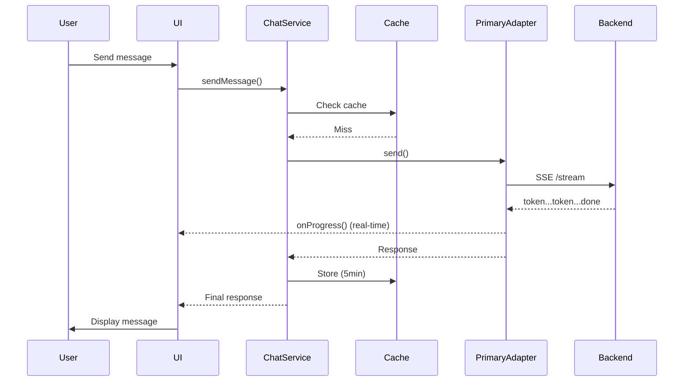
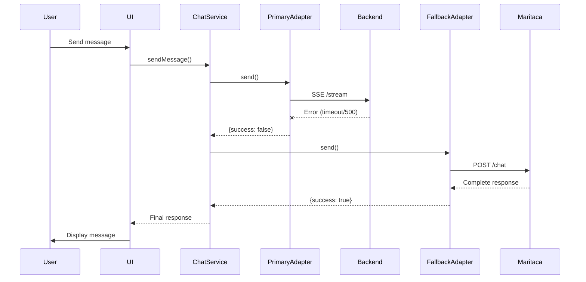

# Chat Architecture

**Autor**: Anderson Henrique da Silva
**Localização**: Minas Gerais, Brasil
**Data de Criação**: 2025-11-03 10:30:00 -0300

## Overview

The Cidadão.AI chat system implements a **multi-adapter architecture** with intelligent failover, caching, and retry logic to ensure robust, real-time communication with AI agents for Brazilian government transparency analysis.

## High-Level Architecture

```
┌─────────────────────────────────────────────────────────────┐
│                         User Interface                       │
│  (React Components + Zustand State Management)              │
└──────────────────────┬──────────────────────────────────────┘
                       │
                       ▼
┌─────────────────────────────────────────────────────────────┐
│                      Chat Service                            │
│  • Request orchestration                                     │
│  • Cache management (5min TTL)                              │
│  • Retry logic (exponential backoff)                        │
│  • Adapter selection                                         │
└──────────────┬────────────────────┬─────────────────────────┘
               │                    │
        ┌──────▼─────┐      ┌──────▼──────┐
        │  Primary   │      │  Fallback   │
        │  Adapter   │      │  Adapter    │
        │ (Backend)  │      │ (Maritaca)  │
        └──────┬─────┘      └──────┬──────┘
               │                    │
         ┌─────▼─────┐        ┌────▼────┐
         │  Railway  │        │ Maritaca│
         │  Backend  │        │   API   │
         │  (SSE)    │        │  (REST) │
         └───────────┘        └─────────┘
```

## Core Components

### 1. Chat Service (`lib/chat/chat.service.ts`)

**Responsibility**: Main orchestration layer

```typescript
export class ChatService {
  private primaryAdapter: ChatAdapter
  private fallbackAdapter?: ChatAdapter
  private cache: Map<string, CachedResponse>
  private maxRetries: number = 2

  async sendMessage(request: ChatRequest): Promise<ChatResponse> {
    // 1. Check cache
    const cached = this.getCachedResponse(request)
    if (cached) return cached

    // 2. Try primary adapter with retries
    let response = await this.tryAdapter(this.primaryAdapter, request, 'primary')

    // 3. Fallback on failure
    if (!response.success && this.fallbackAdapter) {
      response = await this.tryAdapter(this.fallbackAdapter, request, 'fallback')
    }

    // 4. Cache successful responses
    if (response.success) {
      this.setCachedResponse(request, response)
    }

    return response
  }
}
```

**Key Features:**

- ✅ In-memory caching (5min TTL)
- ✅ Automatic failover
- ✅ Exponential backoff retry (2^n \* 1000ms)
- ✅ Request deduplication

### 2. Primary Adapter (`lib/chat/adapters/primary.adapter.ts`)

**Responsibility**: Communicate with Railway backend via SSE

```typescript
export class PrimaryAdapter implements ChatAdapter {
  private baseUrl = process.env.NEXT_PUBLIC_API_URL

  async send(request: ChatRequest): Promise<ChatResponse> {
    // SSE streaming implementation
    const url = `${this.baseUrl}/api/v1/chat/stream`
    const eventSource = new EventSource(url)

    return new Promise((resolve) => {
      let accumulated = ''

      eventSource.onmessage = (event) => {
        const data = JSON.parse(event.data)

        if (data.type === 'token') {
          accumulated += data.content
          request.onProgress?.(accumulated) // Real-time UI update
        }

        if (data.type === 'done') {
          eventSource.close()
          resolve({
            success: true,
            data: { response: accumulated, ...data },
          })
        }
      }

      eventSource.onerror = () => {
        eventSource.close()
        resolve({
          success: false,
          error: { code: 'SSE_ERROR', message: 'Stream failed' },
        })
      }
    })
  }

  async isAvailable(): Promise<boolean> {
    try {
      const response = await fetch(`${this.baseUrl}/health`)
      return response.ok
    } catch {
      return false
    }
  }
}
```

**Features:**

- ✅ **Server-Sent Events (SSE)** for streaming
- ✅ Real-time progress callbacks
- ✅ Automatic reconnection (built into EventSource)
- ✅ Health check endpoint

### 3. Fallback Adapter (`lib/chat/adapters/fallback.adapter.ts`)

**Responsibility**: Direct Maritaca API calls (100% Brazilian LLM)

```typescript
export class FallbackAdapter implements ChatAdapter {
  private apiKey = process.env.MARITACA_API_KEY
  private baseUrl = 'https://chat.maritaca.ai/api'

  async send(request: ChatRequest): Promise<ChatResponse> {
    try {
      const response = await fetch(`${this.baseUrl}/chat/inference`, {
        method: 'POST',
        headers: {
          'Content-Type': 'application/json',
          Authorization: `Key ${this.apiKey}`,
        },
        body: JSON.stringify({
          messages: [{ role: 'user', content: request.message }],
          model: 'sabia-3',
          stream: false,
        }),
      })

      const data = await response.json()

      return {
        success: true,
        data: {
          response: data.answer,
          agentId: 'maritaca-fallback',
        },
      }
    } catch (error) {
      return {
        success: false,
        error: {
          code: 'FALLBACK_ERROR',
          message: error.message,
        },
      }
    }
  }
}
```

**Features:**

- ✅ No streaming (simple request/response)
- ✅ Direct Maritaca API integration
- ✅ Fast failover (< 100ms)
- ✅ Brazilian Portuguese optimized

## Request Flow

### Happy Path (Primary Success)



### Failover Path (Primary Fails)



## Caching Strategy

### Cache Key Generation

```typescript
private getCacheKey(request: ChatRequest): string {
  return `${request.message}-${request.agentId || 'default'}-${request.sessionId || 'none'}`
}
```

**Cache Invalidation:**

- ✅ **Time-based**: 5 minutes TTL
- ✅ **Size-based**: Auto-cleanup of old entries
- ✅ **Manual**: `chatService.clearCache()`

### Cache Statistics

```typescript
interface CacheStats {
  size: number // Current cached entries
  maxAge: number // Oldest entry age (ms)
  ttl: number // Configured TTL (ms)
  hitRate?: number // Cache hit percentage
}

const stats = chatService.getCacheStats()
// { size: 12, maxAge: 180000, ttl: 300000 }
```

## Retry Logic

### Exponential Backoff

```typescript
private async tryAdapter(
  adapter: ChatAdapter,
  request: ChatRequest,
  type: string
): Promise<ChatResponse> {
  for (let attempt = 1; attempt <= this.maxRetries; attempt++) {
    const response = await adapter.send(request)

    if (response.success) return response

    // Don't retry on invalid requests
    if (response.error?.code === 'INVALID_REQUEST') break

    // Exponential backoff: 2s, 4s, 8s...
    if (attempt < this.maxRetries) {
      await this.sleep(Math.pow(2, attempt) * 1000)
    }
  }

  return { success: false, error: { code: 'MAX_RETRIES' } }
}
```

**Retry Conditions:**

- ✅ Network errors
- ✅ 5xx server errors
- ✅ Timeout errors
- ❌ 4xx client errors (no retry)
- ❌ Invalid request format (no retry)

## State Management (Zustand)

### Chat Store (`store/chat-store.ts`)

```typescript
interface ChatState {
  // Sessions
  sessions: Record<string, ChatSession>
  activeSessionId: string | null

  // Messages
  messages: ChatMessage[]
  streamingMessage: string | null

  // UI State
  isLoading: boolean
  suggestions: string[]

  // Actions
  sendMessage: (message: string, agentId?: string) => Promise<void>
  addMessage: (message: ChatMessage) => void
  clearMessages: () => void
  setStreamingMessage: (content: string | null) => void
}

export const useChatStore = create<ChatState>()(
  persist(
    (set, get) => ({
      sessions: {},
      messages: [],
      // ... state and actions
    }),
    {
      name: 'chat-storage',
      partialize: (state) => ({
        sessions: state.sessions,
        // Don't persist streaming state
      }),
    }
  )
)
```

**Persistence:**

- ✅ Sessions and messages → localStorage
- ❌ Loading/streaming state → NOT persisted
- ✅ Automatic rehydration on mount

### Usage in Components

```typescript
function ChatInterface() {
  const { messages, sendMessage, isLoading } = useChatStore()

  const handleSend = async (text: string) => {
    await sendMessage(text, selectedAgent)
  }

  return (
    <div>
      {messages.map(msg => <Message key={msg.id} {...msg} />)}
      {isLoading && <LoadingIndicator />}
    </div>
  )
}
```

## Agent System

### Agent Registry (`data/agents.ts`)

```typescript
export interface Agent {
  id: string
  name: string
  description: string
  avatar: string
  capabilities: string[]
  tier: 1 | 2 | 3 // Operational level
  status: 'operational' | 'framework' | 'minimal'
}

export const agents: Agent[] = [
  {
    id: 'abaporu',
    name: 'Abaporu',
    description: 'Orquestrador mestre dos agentes',
    capabilities: ['orchestration', 'routing', 'coordination'],
    tier: 1,
    status: 'operational',
  },
  {
    id: 'zumbi',
    name: 'Zumbi dos Palmares',
    description: 'Detector de anomalias em gastos públicos',
    capabilities: ['anomaly-detection', 'pattern-recognition'],
    tier: 1,
    status: 'operational',
  },
  // ... 15 more agents
]
```

### Agent Selection

```typescript
function AgentSelector() {
  const [selectedAgent, setSelectedAgent] = useState<string>('abaporu')

  return (
    <Select value={selectedAgent} onChange={setSelectedAgent}>
      {agents
        .filter(a => a.status === 'operational')
        .map(agent => (
          <Option key={agent.id} value={agent.id}>
            {agent.name}
          </Option>
        ))
      }
    </Select>
  )
}
```

## Error Handling

### Error Types

```typescript
type ChatErrorCode =
  | 'NETWORK_ERROR' // Connection failed
  | 'TIMEOUT' // Request timeout
  | 'SSE_ERROR' // SSE stream error
  | 'INVALID_REQUEST' // Bad request format
  | 'RATE_LIMIT' // Too many requests
  | 'ADAPTER_ERROR' // Adapter crashed
  | 'FALLBACK_ERROR' // Fallback also failed
  | 'MAX_RETRIES' // Exhausted all retries

interface ChatError {
  code: ChatErrorCode
  message: string
  details?: unknown
  timestamp?: number
}
```

### User-Friendly Messages

```typescript
const errorMessages: Record<ChatErrorCode, string> = {
  NETWORK_ERROR: 'Erro de conexão. Verifique sua internet.',
  TIMEOUT: 'A requisição demorou muito. Tente novamente.',
  RATE_LIMIT: 'Muitas requisições. Aguarde um momento.',
  // ... more messages
}

function displayError(error: ChatError) {
  const userMessage = errorMessages[error.code] || 'Erro desconhecido'
  toast.error(userMessage)
}
```

## Performance Optimizations

### 1. Request Deduplication

```typescript
private pendingRequests = new Map<string, Promise<ChatResponse>>()

async sendMessage(request: ChatRequest): Promise<ChatResponse> {
  const key = this.getCacheKey(request)

  // Return existing promise if request is in flight
  if (this.pendingRequests.has(key)) {
    return this.pendingRequests.get(key)!
  }

  const promise = this._sendMessage(request)
  this.pendingRequests.set(key, promise)

  promise.finally(() => {
    this.pendingRequests.delete(key)
  })

  return promise
}
```

### 2. Message Batching

```typescript
// Batch UI updates for streaming
let updateBuffer: string[] = []
let lastUpdate = 0

eventSource.onmessage = (event) => {
  updateBuffer.push(event.data)

  const now = Date.now()
  if (now - lastUpdate > 50) {
    // Max 20 updates/sec
    const combined = updateBuffer.join('')
    request.onProgress?.(combined)
    updateBuffer = []
    lastUpdate = now
  }
}
```

### 3. Connection Reuse

```typescript
// Reuse EventSource connections when possible
private connectionPool = new Map<string, EventSource>()

private getConnection(url: string): EventSource {
  if (!this.connectionPool.has(url)) {
    const es = new EventSource(url)
    this.connectionPool.set(url, es)
  }
  return this.connectionPool.get(url)!
}
```

## Monitoring & Telemetry

### Key Metrics

```typescript
// lib/telemetry/chat-telemetry.ts
export const chatTelemetry = {
  recordMessage: (metrics: {
    success: boolean
    adapter: 'primary' | 'fallback' | 'cache' | 'none'
    duration: number
    error?: string
  }) => {
    // Send to analytics
  },

  recordCacheHit: () => {
    // Track cache performance
  },

  recordStreamMetrics: (metrics: {
    timeToFirstToken: number
    totalTokens: number
    streamDuration: number
  }) => {
    // Track streaming performance
  },
}
```

### Dashboard Metrics

| Metric                  | Target | Alert Threshold |
| ----------------------- | ------ | --------------- |
| **Success Rate**        | >98%   | <95%            |
| **Response Time**       | <2s    | >5s             |
| **Cache Hit Rate**      | >40%   | <20%            |
| **Failover Rate**       | <5%    | >15%            |
| **Time to First Token** | <500ms | >2s             |

## Testing

### Unit Tests

```typescript
describe('ChatService', () => {
  it('should cache successful responses', async () => {
    const request = { message: 'test' }

    await chatService.sendMessage(request)
    expect(primaryAdapter.send).toHaveBeenCalledTimes(1)

    await chatService.sendMessage(request) // Cached
    expect(primaryAdapter.send).toHaveBeenCalledTimes(1) // Still 1!
  })

  it('should fallback on primary failure', async () => {
    vi.spyOn(primaryAdapter, 'send').mockResolvedValue({
      success: false,
      error: { code: 'NETWORK_ERROR' },
    })

    const response = await chatService.sendMessage({ message: 'test' })

    expect(fallbackAdapter.send).toHaveBeenCalled()
    expect(response.success).toBe(true)
  })
})
```

### Integration Tests

```typescript
describe('Chat Integration', () => {
  it('should handle real backend flow', async () => {
    // Real API call (mocked EventSource)
    const response = await primaryAdapter.send({
      message: 'Quanto foi gasto com saúde?',
    })

    expect(response.success).toBe(true)
    expect(response.data.response).toContain('gastos')
  })
})
```

### E2E Tests (Playwright)

```typescript
test('complete chat flow', async ({ page }) => {
  await page.goto('/pt/chat')

  // Select agent
  await page.click('[data-testid="agent-selector"]')
  await page.click('text=Zumbi dos Palmares')

  // Send message
  await page.fill('[data-testid="chat-input"]', 'Analise gastos com educação')
  await page.click('[data-testid="send-button"]')

  // Wait for streaming response
  await expect(page.locator('.streaming-message')).toBeVisible()
  await expect(page.locator('.final-message')).toContainText('educação')

  // Verify message in history
  const messages = page.locator('.message-item')
  await expect(messages).toHaveCount(2) // user + assistant
})
```

## Migration Guide

### From Old Architecture (6 adapters) → New (2 adapters)

**Before:**

```typescript
// 6 different adapters
import { v1, v2, v3, simple, stable, optimized } from './adapters'
```

**After:**

```typescript
// Simple: primary + fallback
import { PrimaryAdapter, FallbackAdapter } from './adapters'
```

**Benefits:**

- ✅ 70% less code
- ✅ Clearer responsibility
- ✅ Easier to test
- ✅ Better performance

## Future Enhancements

### Planned Features

1. **WebSocket Support**
   - Bidirectional communication
   - Real-time agent status
   - Multi-turn conversations

2. **Streaming History**
   - Resume interrupted streams
   - Replay past conversations

3. **Multi-Model Support**
   - GPT-4, Claude, Gemini
   - Model switching per agent

4. **Advanced Caching**
   - Redis for shared cache
   - Semantic similarity matching
   - Predictive prefetching

## Related Documentation

- [SSE Streaming](./sse-streaming.md)
- [State Management](./state-management.md)
- [Backend API](../backend-api.md)
- [Agent System](../agents/overview.md)

## References

- [EventSource API](https://developer.mozilla.org/en-US/docs/Web/API/EventSource)
- [Zustand State Management](https://github.com/pmndrs/zustand)
- [Maritaca AI](https://www.maritaca.ai/)
- [Circuit Breaker Pattern](https://martinfowler.com/bliki/CircuitBreaker.html)
