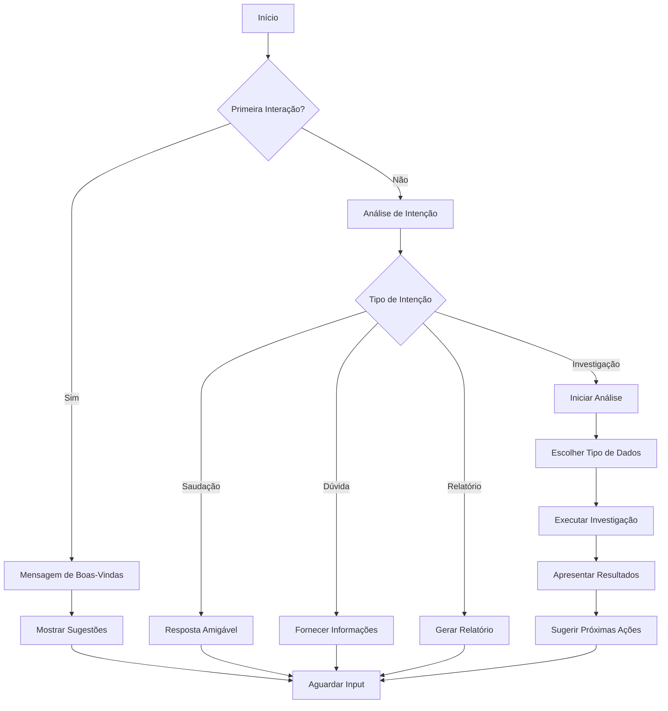

# MANUAL DE INTEGRAÇÃO FRONTEND NEXT.JS - CIDADÃO.AI

**Data:** 19/09/2025 15:28:24  
**Autor:** Anderson Henrique d Silva

## 1. CONFIGURAÇÃO INICIAL

### Instalação das Dependências

```bash
npm install axios @tanstack/react-query socket.io-client eventsource-polyfill
npm install -D @types/eventsource
```

### Variáveis de Ambiente (.env.local)

```env
NEXT_PUBLIC_API_URL=https://cidadao-api-production.up.railway.app
NEXT_PUBLIC_WS_URL=wss://cidadao-api-production.up.railway.app
```

## 2. CLIENTE API BASE

```typescript
// lib/api/client.ts
import axios from 'axios'

const API_URL = process.env.NEXT_PUBLIC_API_URL

export const apiClient = axios.create({
  baseURL: API_URL,
  headers: {
    'Content-Type': 'application/json',
  },
})

// Interceptor para adicionar token JWT
apiClient.interceptors.request.use((config) => {
  const token = localStorage.getItem('access_token')
  if (token) {
    config.headers.Authorization = `Bearer ${token}`
  }
  return config
})

// Interceptor para refresh token
apiClient.interceptors.response.use(
  (response) => response,
  async (error) => {
    if (error.response?.status === 401) {
      const refreshToken = localStorage.getItem('refresh_token')
      if (refreshToken) {
        try {
          const { data } = await axios.post(`${API_URL}/auth/refresh`, {
            refresh_token: refreshToken,
          })
          localStorage.setItem('access_token', data.access_token)
          error.config.headers.Authorization = `Bearer ${data.access_token}`
          return apiClient(error.config)
        } catch {
          // Redirecionar para login
          window.location.href = '/login'
        }
      }
    }
    return Promise.reject(error)
  }
)
```

## 3. HOOKS PARA CHAT

```typescript
// hooks/useChat.ts
import { useState, useCallback } from 'react'
import { apiClient } from '@/lib/api/client'
import { v4 as uuidv4 } from 'uuid'

interface ChatMessage {
  id: string
  role: 'user' | 'assistant'
  content: string
  timestamp: Date
  agent?: string
  confidence?: number
  suggested_actions?: string[]
}

export function useChat() {
  const [messages, setMessages] = useState<ChatMessage[]>([])
  const [sessionId] = useState(() => uuidv4())
  const [isLoading, setIsLoading] = useState(false)

  const sendMessage = useCallback(
    async (content: string) => {
      // Adicionar mensagem do usuário
      const userMessage: ChatMessage = {
        id: uuidv4(),
        role: 'user',
        content,
        timestamp: new Date(),
      }

      setMessages((prev) => [...prev, userMessage])
      setIsLoading(true)

      try {
        const { data } = await apiClient.post('/api/v1/chat/message', {
          message: content,
          session_id: sessionId,
        })

        const assistantMessage: ChatMessage = {
          id: uuidv4(),
          role: 'assistant',
          content: data.message,
          timestamp: new Date(),
          agent: data.agent_name,
          confidence: data.confidence,
          suggested_actions: data.suggested_actions,
        }

        setMessages((prev) => [...prev, assistantMessage])
      } catch (error) {
        console.error('Erro ao enviar mensagem:', error)
      } finally {
        setIsLoading(false)
      }
    },
    [sessionId]
  )

  return { messages, sendMessage, isLoading, sessionId }
}
```

## 4. STREAMING COM SERVER-SENT EVENTS

```typescript
// hooks/useChatStream.ts
import { useState, useCallback, useRef } from 'react'
import { EventSourcePolyfill } from 'eventsource-polyfill'

export function useChatStream() {
  const [streamingMessage, setStreamingMessage] = useState('')
  const eventSourceRef = useRef<EventSourcePolyfill | null>(null)

  const startStream = useCallback(async (message: string, sessionId: string) => {
    // Fechar stream anterior se existir
    if (eventSourceRef.current) {
      eventSourceRef.current.close()
    }

    const token = localStorage.getItem('access_token')
    const url = `${process.env.NEXT_PUBLIC_API_URL}/api/v1/chat/stream`

    eventSourceRef.current = new EventSourcePolyfill(url, {
      headers: {
        Authorization: `Bearer ${token}`,
        'Content-Type': 'application/json',
      },
      method: 'POST',
      body: JSON.stringify({ message, session_id: sessionId }),
    })

    eventSourceRef.current.onmessage = (event) => {
      const data = JSON.parse(event.data)
      if (data.type === 'chunk') {
        setStreamingMessage((prev) => prev + data.content)
      } else if (data.type === 'done') {
        eventSourceRef.current?.close()
      }
    }

    eventSourceRef.current.onerror = () => {
      eventSourceRef.current?.close()
    }
  }, [])

  const stopStream = useCallback(() => {
    eventSourceRef.current?.close()
  }, [])

  return { streamingMessage, startStream, stopStream }
}
```

## 5. WEBSOCKET PARA CHAT BIDIRECIONAL

```typescript
// hooks/useChatWebSocket.ts
import { useEffect, useRef, useState, useCallback } from 'react'
import io, { Socket } from 'socket.io-client'

interface WebSocketMessage {
  type: 'chat' | 'status' | 'notification'
  data: any
  timestamp: string
  id: string
}

export function useChatWebSocket(sessionId: string) {
  const socketRef = useRef<Socket | null>(null)
  const [isConnected, setIsConnected] = useState(false)
  const [lastMessage, setLastMessage] = useState<WebSocketMessage | null>(null)

  useEffect(() => {
    const token = localStorage.getItem('access_token')
    const wsUrl = `${process.env.NEXT_PUBLIC_WS_URL}/api/v1/ws/chat/${sessionId}`

    socketRef.current = io(wsUrl, {
      auth: { token },
      transports: ['websocket'],
    })

    socketRef.current.on('connect', () => {
      setIsConnected(true)
      console.log('WebSocket conectado')
    })

    socketRef.current.on('disconnect', () => {
      setIsConnected(false)
      console.log('WebSocket desconectado')
    })

    socketRef.current.on('message', (message: WebSocketMessage) => {
      setLastMessage(message)
    })

    // Heartbeat para manter conexão ativa
    const heartbeatInterval = setInterval(() => {
      if (socketRef.current?.connected) {
        socketRef.current.emit('message', {
          type: 'ping',
          data: {},
          timestamp: new Date().toISOString(),
          id: crypto.randomUUID(),
        })
      }
    }, 30000) // 30 segundos

    return () => {
      clearInterval(heartbeatInterval)
      socketRef.current?.disconnect()
    }
  }, [sessionId])

  const sendMessage = useCallback((content: string) => {
    if (socketRef.current?.connected) {
      const message: WebSocketMessage = {
        type: 'chat',
        data: { content },
        timestamp: new Date().toISOString(),
        id: crypto.randomUUID(),
      }
      socketRef.current.emit('message', message)
    }
  }, [])

  return { isConnected, lastMessage, sendMessage }
}
```

## 6. COMPONENTE DE CHAT COMPLETO

```typescript
// components/Chat/ChatInterface.tsx
import React, { useState, useEffect } from 'react';
import { useChat } from '@/hooks/useChat';
import { useChatWebSocket } from '@/hooks/useChatWebSocket';
import { Button } from '@/components/ui/button';
import { Input } from '@/components/ui/input';
import { Card } from '@/components/ui/card';

export function ChatInterface() {
  const { messages, sendMessage, isLoading, sessionId } = useChat();
  const { isConnected, lastMessage } = useChatWebSocket(sessionId);
  const [input, setInput] = useState('');
  const [suggestions, setSuggestions] = useState<any[]>([]);

  // Buscar sugestões ao montar componente
  useEffect(() => {
    fetchSuggestions();
  }, []);

  // Processar mensagens do WebSocket
  useEffect(() => {
    if (lastMessage?.type === 'chat') {
      // Adicionar mensagem do assistente vinda do WebSocket
      const newMessage = {
        id: lastMessage.id,
        role: 'assistant' as const,
        content: lastMessage.data.content,
        timestamp: new Date(lastMessage.timestamp),
        agent: lastMessage.data.agent_name,
        confidence: lastMessage.data.confidence,
      };
      // Adicionar à lista de mensagens
    }
  }, [lastMessage]);

  const fetchSuggestions = async () => {
    try {
      const { data } = await apiClient.get('/api/v1/chat/suggestions');
      setSuggestions(data.suggestions);
    } catch (error) {
      console.error('Erro ao buscar sugestões:', error);
    }
  };

  const handleSubmit = async (e: React.FormEvent) => {
    e.preventDefault();
    if (input.trim()) {
      await sendMessage(input);
      setInput('');
    }
  };

  const handleSuggestionClick = (action: string) => {
    sendMessage(action);
  };

  return (
    <div className="flex flex-col h-screen max-w-4xl mx-auto p-4">
      {/* Status da conexão */}
      <div className="mb-4 flex items-center gap-2">
        <div className={`w-2 h-2 rounded-full ${isConnected ? 'bg-green-500' : 'bg-red-500'}`} />
        <span className="text-sm text-gray-600">
          {isConnected ? 'Conectado' : 'Desconectado'}
        </span>
      </div>

      {/* Lista de mensagens */}
      <div className="flex-1 overflow-y-auto mb-4 space-y-4">
        {messages.length === 0 && (
          <Card className="p-6 text-center">
            <h2 className="text-xl font-bold mb-4">Bem-vindo ao Cidadão.AI</h2>
            <p className="text-gray-600 mb-6">
              Sou seu assistente para análise de transparência governamental.
              Como posso ajudar você hoje?
            </p>

            {/* Sugestões rápidas */}
            <div className="grid grid-cols-2 gap-2">
              {suggestions.map((suggestion) => (
                <Button
                  key={suggestion.id}
                  variant="outline"
                  onClick={() => handleSuggestionClick(suggestion.action)}
                  className="text-left"
                >
                  <span className="mr-2">{suggestion.icon}</span>
                  {suggestion.label}
                </Button>
              ))}
            </div>
          </Card>
        )}

        {messages.map((message) => (
          <Card
            key={message.id}
            className={`p-4 ${
              message.role === 'user' ? 'ml-auto bg-blue-50' : 'mr-auto'
            } max-w-[80%]`}
          >
            {message.agent && (
              <div className="text-sm text-gray-500 mb-1">
                {message.agent} {message.confidence && `(${Math.round(message.confidence * 100)}% confiança)`}
              </div>
            )}
            <div className="whitespace-pre-wrap">{message.content}</div>

            {/* Ações sugeridas */}
            {message.suggested_actions && message.suggested_actions.length > 0 && (
              <div className="mt-3 flex gap-2 flex-wrap">
                {message.suggested_actions.map((action) => (
                  <Button
                    key={action}
                    size="sm"
                    variant="secondary"
                    onClick={() => sendMessage(action)}
                  >
                    {action}
                  </Button>
                ))}
              </div>
            )}
          </Card>
        ))}

        {isLoading && (
          <Card className="p-4 mr-auto">
            <div className="flex items-center gap-2">
              <div className="animate-spin h-4 w-4 border-2 border-gray-500 rounded-full border-t-transparent" />
              <span className="text-gray-500">Pensando...</span>
            </div>
          </Card>
        )}
      </div>

      {/* Formulário de entrada */}
      <form onSubmit={handleSubmit} className="flex gap-2">
        <Input
          value={input}
          onChange={(e) => setInput(e.target.value)}
          placeholder="Digite sua pergunta sobre transparência governamental..."
          disabled={isLoading}
          className="flex-1"
        />
        <Button type="submit" disabled={isLoading || !input.trim()}>
          Enviar
        </Button>
      </form>
    </div>
  );
}
```

## 7. FLUXO CONVERSACIONAL PROPOSTO

### Estrutura do Fluxo



### Exemplos de Diálogos

#### 1. Fluxo de Boas-Vindas

```
🤖 Cidadão.AI: Olá! Sou o assistente do Cidadão.AI, especializado em análise de transparência governamental.

Posso ajudar você a:
🔍 Investigar contratos públicos
📊 Analisar despesas governamentais
🚨 Detectar anomalias em licitações
📋 Gerar relatórios detalhados

Por onde gostaria de começar?

👤 Usuário: Quero investigar contratos de saúde

🤖 Cidadão.AI: Excelente! Vou analisar contratos na área de saúde.

Para uma análise mais precisa, você pode me informar:
- Período específico (ex: 2024)
- Órgão de interesse (ex: Ministério da Saúde)
- Valor mínimo dos contratos

Ou posso fazer uma análise geral dos últimos 12 meses. O que prefere?
```

#### 2. Fluxo de Investigação

```
👤 Usuário: Analise contratos do Ministério da Saúde acima de 1 milhão em 2024

🤖 Zumbi dos Palmares: Iniciando investigação detalhada...

📊 ANÁLISE EM ANDAMENTO:
- Coletando dados do Portal da Transparência...
- Aplicando algoritmos de detecção de anomalias...
- Verificando padrões irregulares...

✅ ANÁLISE CONCLUÍDA

🚨 ANOMALIAS DETECTADAS: 3

1. **Concentração de Fornecedor** (Alta Severidade)
   - Empresa XYZ Ltda: 45% dos contratos
   - Valor total: R$ 23.5 milhões
   - Padrão suspeito: Sempre vence com margem mínima

2. **Sobrepreço Identificado** (Média Severidade)
   - Contrato #2024-001234
   - Item: Seringas descartáveis
   - Preço pago: R$ 2.30/unidade (280% acima da média)

3. **Periodicidade Anômala** (Baixa Severidade)
   - Contratos sempre assinados no dia 28
   - Padrão detectado em 8 ocorrências

Deseja:
📋 Ver detalhes completos
📊 Gerar relatório PDF
🔍 Investigar fornecedor específico
📈 Analisar tendências temporais
```

#### 3. Fluxo de Ajuda

```
👤 Usuário: Como funciona a detecção de anomalias?

🤖 Carlos Drummond: Ótima pergunta! Nossa detecção de anomalias utiliza múltiplas técnicas:

📊 **Análise Estatística**
- Z-score para identificar valores fora do padrão
- Análise de quartis para outliers

🤖 **Machine Learning**
- Isolation Forest para padrões complexos
- Clustering para agrupar comportamentos similares

🔬 **Análise Espectral**
- FFT para detectar periodicidades suspeitas
- Útil para identificar pagamentos regulares anômalos

📈 **IA Explicável**
- SHAP values para transparência
- Cada anomalia vem com explicação detalhada

Gostaria de ver um exemplo prático ou tem alguma dúvida específica?
```

### Melhores Práticas para UX

1. **Feedback Visual Constante**
   - Indicadores de carregamento durante análises
   - Status de conexão sempre visível
   - Progresso de investigações longas

2. **Sugestões Contextuais**
   - Após cada resposta, sugerir próximos passos
   - Botões de ação rápida baseados no contexto
   - Histórico de investigações acessível

3. **Gestão de Erros**
   - Mensagens claras quando dados não disponíveis
   - Alternativas quando API governamental falha
   - Modo demo para demonstrações

4. **Personalização**
   - Salvar preferências de investigação
   - Histórico de sessões anteriores
   - Filtros favoritos

## 8. TRATAMENTO DE ERROS

```typescript
// utils/errorHandler.ts
export class ChatError extends Error {
  constructor(
    message: string,
    public code: string,
    public statusCode: number
  ) {
    super(message)
  }
}

export function handleChatError(error: any): string {
  if (error.response?.data?.detail) {
    const detail = error.response.data.detail

    switch (detail.code) {
      case 'AGENT_UNAVAILABLE':
        return 'O assistente está temporariamente indisponível. Tente novamente.'
      case 'RATE_LIMIT_EXCEEDED':
        return 'Muitas requisições. Aguarde um momento.'
      case 'INVALID_REQUEST':
        return 'Requisição inválida. Verifique os dados.'
      default:
        return detail.message || 'Erro ao processar requisição.'
    }
  }

  return 'Erro de conexão. Verifique sua internet.'
}
```

## 9. MONITORAMENTO E ANALYTICS

```typescript
// utils/analytics.ts
export const chatAnalytics = {
  trackMessage: (sessionId: string, role: 'user' | 'assistant', agent?: string) => {
    // Enviar para analytics
    if (typeof window !== 'undefined' && window.gtag) {
      window.gtag('event', 'chat_message', {
        session_id: sessionId,
        role,
        agent,
      })
    }
  },

  trackInvestigation: (type: string, anomaliesFound: number) => {
    if (typeof window !== 'undefined' && window.gtag) {
      window.gtag('event', 'investigation_completed', {
        investigation_type: type,
        anomalies_found: anomaliesFound,
      })
    }
  },

  trackError: (error: string, context: any) => {
    console.error('Chat Error:', error, context)
    // Enviar para serviço de monitoramento
  },
}
```

## 10. DEPLOY NA VERCEL

### Configuração do projeto

```json
// vercel.json
{
  "env": {
    "NEXT_PUBLIC_API_URL": "https://cidadao-api-production.up.railway.app",
    "NEXT_PUBLIC_WS_URL": "wss://cidadao-api-production.up.railway.app"
  },
  "headers": [
    {
      "source": "/(.*)",
      "headers": [
        {
          "key": "Content-Security-Policy",
          "value": "default-src 'self'; connect-src 'self' https://cidadao-api-production.up.railway.app wss://cidadao-api-production.up.railway.app"
        }
      ]
    }
  ]
}
```

### Script de Deploy

```bash
# Deploy para Vercel
vercel --prod

# Variáveis de ambiente necessárias no Vercel Dashboard:
# - NEXT_PUBLIC_API_URL
# - NEXT_PUBLIC_WS_URL
# - Qualquer outra variável específica do projeto
```

## CONCLUSÃO

Este manual fornece uma base completa para integrar o frontend Next.js com o backend Cidadão.AI. O fluxo conversacional proposto oferece uma experiência intuitiva para análise de transparência governamental, com suporte a investigações em tempo real, detecção de anomalias e geração de relatórios.

Para questões técnicas ou suporte adicional, consulte a documentação da API em: https://cidadao-api-production.up.railway.app/docs

---

**Documento preparado por:** Anderson Henrique d Silva  
**Data:** 19/09/2025
