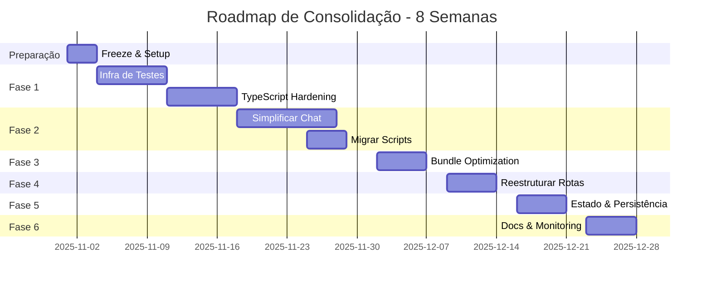

# 🚀 ROADMAP DE CONSOLIDAÇÃO - CIDADÃO.AI FRONTEND

**Autor**: Anderson Henrique da Silva
**Data de Criação**: 2025-10-31 22:35:00 -0300
**Duração Estimada**: 8 semanas
**Objetivo**: Refatoração completa para sustentabilidade e escalabilidade

---

## 📊 SITUAÇÃO ATUAL

### Métricas de Débito Técnico
- **Complexidade do Chat**: 6 adapters + 3 camadas de abstração
- **Cobertura de Testes**: ~0% (6 testes reais vs 55 scripts manuais)
- **Duplicação de Código**: ~35% estimado
- **Bundle Size**: Não monitorado (estimado >2MB)
- **Performance Score**: Não medido
- **Manutenibilidade**: 5/10

### Riscos Identificados
1. 🔴 **CRÍTICO**: Sistema de chat impossível de debugar
2. 🔴 **CRÍTICO**: Zero automação de testes
3. 🟡 **ALTO**: Bundle size descontrolado
4. 🟡 **ALTO**: Estrutura de rotas inconsistente
5. 🟡 **MÉDIO**: Estado global sem versionamento

---

## 🎯 OBJETIVOS DA CONSOLIDAÇÃO

### Metas Quantitativas
- Cobertura de testes: **70% mínimo**
- Bundle size: **<500KB gzipped**
- Lighthouse Score: **>90 em todas as métricas**
- Chat adapters: **Máximo 2**
- Build time: **<2 minutos**
- Complexidade ciclomática: **<10 por função**

### Metas Qualitativas
- Código 100% tipado (sem `any`)
- CI/CD totalmente automatizado
- Documentação atualizada
- Zero scripts manuais de teste
- Arquitetura simplificada e clara

---

## 📅 FASES DO ROADMAP

## **FASE 0: PREPARAÇÃO** (Semana 0 - 3 dias)
*"Stop the bleeding"*

### Ações Imediatas
- [ ] Freeze de novas features
- [ ] Backup completo do código atual
- [ ] Criar branch `consolidation-2025`
- [ ] Setup de métricas baseline
- [ ] Documentar fluxos críticos atuais

### Entregáveis
- Documento de baseline metrics
- Fluxograma do sistema atual
- Lista de dependências críticas

---

## **FASE 1: FUNDAÇÃO** (Semana 1-2)
*"Estabelecer base sólida"*

### 1.1 Infraestrutura de Testes
```bash
# Semana 1
- [ ] Configurar Vitest corretamente
- [ ] Implementar testes unitários para utils
- [ ] Adicionar testes de integração para services
- [ ] Setup coverage reports
- [ ] CI com testes obrigatórios
```

### 1.2 TypeScript Hardening
```typescript
// tsconfig.json melhorias
{
  "compilerOptions": {
    "strict": true,
    "noUncheckedIndexedAccess": true,
    "noImplicitAny": true,
    "strictNullChecks": true,
    "skipLibCheck": false, // Remover isto!
    "exactOptionalPropertyTypes": true
  }
}
```

### 1.3 Linting & Formatting
```bash
- [ ] ESLint config strict
- [ ] Prettier com regras consistentes
- [ ] Husky + lint-staged
- [ ] Commitlint para conventional commits
```

### Métricas de Sucesso
- ✅ 30% cobertura de testes
- ✅ Zero erros TypeScript
- ✅ CI pipeline funcional

---

## **FASE 2: SIMPLIFICAÇÃO DO CHAT** (Semana 3-4)
*"Eliminar complexidade desnecessária"*

### 2.1 Nova Arquitetura de Chat

#### ANTES (6 adapters):
```
chat.service.ts
├── chat-adapter-backend.ts
├── chat-adapter-fallback.ts
├── chat-adapter-maritaca.ts
├── chat-adapter-sse.ts
├── smart-chat.service.ts
└── chat-cache.service.ts
```

#### DEPOIS (2 adapters):
```
chat.service.ts
├── adapters/
│   ├── primary.adapter.ts    // Backend oficial
│   └── fallback.adapter.ts   // Maritaca fallback
├── chat.store.ts              // Estado centralizado
└── chat.types.ts              // Tipos únicos
```

### 2.2 Implementação
```typescript
// lib/chat/chat.service.ts
class ChatService {
  private primaryAdapter: IChatAdapter
  private fallbackAdapter: IChatAdapter

  async sendMessage(message: string): Promise<ChatResponse> {
    try {
      return await this.primaryAdapter.send(message)
    } catch (error) {
      logger.warn('Primary adapter failed, using fallback')
      return await this.fallbackAdapter.send(message)
    }
  }
}
```

### 2.3 Migração dos Scripts de Teste
```bash
# Converter todos os 55 scripts para testes reais
scripts/test-chat-*.js → __tests__/chat/*.test.ts
scripts/test-backend-*.js → __tests__/integration/*.test.ts
```

### Métricas de Sucesso
- ✅ Máximo 2 chat adapters
- ✅ 50% menos código no sistema de chat
- ✅ 100% dos fluxos de chat testados

---

## **FASE 3: OTIMIZAÇÃO DE PERFORMANCE** (Semana 5)
*"Fazer voar"*

### 3.1 Bundle Optimization
```javascript
// next.config.mjs
export default {
  experimental: {
    optimizeCss: true,
    optimizePackageImports: [
      'd3',
      'recharts',
      'lucide-react'
    ]
  },

  webpack: (config) => {
    config.optimization.splitChunks = {
      chunks: 'all',
      cacheGroups: {
        d3: {
          test: /[\\/]node_modules[\\/]d3/,
          name: 'd3',
          priority: 10,
        },
        pdf: {
          test: /[\\/]node_modules[\\/](jspdf|html2canvas)/,
          name: 'pdf-generation',
          priority: 10,
        }
      }
    }
    return config
  }
}
```

### 3.2 Lazy Loading Estratégico
```typescript
// Componentes pesados com dynamic imports
const PDFExporter = dynamic(
  () => import('@/components/export/pdf-exporter'),
  {
    loading: () => <Skeleton />,
    ssr: false
  }
)

const ChartsPanel = dynamic(
  () => import('@/components/charts/charts-panel'),
  {
    loading: () => <ChartsSkeleton />,
    ssr: false
  }
)
```

### 3.3 Cache Strategy Melhorada
```typescript
// lib/cache/cache.config.ts
export const cacheConfig = {
  api: {
    agents: { ttl: 3600, stale: 7200 },      // 1h cache, 2h stale
    suggestions: { ttl: 300, stale: 600 },    // 5min cache
    investigations: { ttl: 60, stale: 120 }   // 1min cache
  },
  assets: {
    images: { ttl: 86400 },   // 24h
    fonts: { ttl: 604800 }    // 7 dias
  }
}
```

### Métricas de Sucesso
- ✅ Bundle < 500KB gzipped
- ✅ FCP < 1.5s
- ✅ TTI < 3s
- ✅ Lighthouse Performance > 90

---

## **FASE 4: REESTRUTURAÇÃO DE ROTAS** (Semana 6)
*"Organização clara"*

### 4.1 Nova Estrutura
```
app/
├── (public)/                  # Rotas públicas
│   ├── layout.tsx
│   ├── page.tsx              # Landing
│   ├── login/
│   ├── about/
│   └── privacy/
│
├── (protected)/              # Rotas autenticadas
│   ├── layout.tsx           # Auth check + nav
│   ├── chat/
│   ├── dashboard/
│   ├── investigations/
│   └── settings/
│
├── api/                     # API Routes
│   ├── chat/
│   ├── export/
│   └── telemetry/
│
└── [locale]/               # i18n wrapper
    └── [[...slug]]/       # Catch-all para i18n
```

### 4.2 Middleware Simplificado
```typescript
// middleware.ts
export function middleware(request: NextRequest) {
  const { pathname } = request.nextUrl

  // Rotas protegidas
  const protectedPaths = ['/chat', '/dashboard', '/investigations']
  const isProtected = protectedPaths.some(path =>
    pathname.includes(path)
  )

  if (isProtected && !hasValidSession(request)) {
    return NextResponse.redirect('/login')
  }

  return NextResponse.next()
}
```

### Métricas de Sucesso
- ✅ Estrutura de rotas consistente
- ✅ Zero duplicação de layouts
- ✅ Middleware < 50 linhas

---

## **FASE 5: ESTADO E PERSISTÊNCIA** (Semana 7)
*"Estado previsível"*

### 5.1 Zustand com Versionamento
```typescript
// stores/base.store.ts
interface StoreVersion {
  version: number
  migrate: (state: any) => any
}

const migrations: Record<number, (state: any) => any> = {
  1: (state) => ({ ...state, newField: 'default' }),
  2: (state) => ({ ...state, renamedField: state.oldField })
}

export const createVersionedStore = <T>(
  name: string,
  version: number,
  creator: StateCreator<T>
) => {
  return create<T>()(
    persist(
      devtools(creator),
      {
        name,
        version,
        migrate: (state, version) => {
          // Apply migrations sequentially
          for (let v = version; v < currentVersion; v++) {
            state = migrations[v](state)
          }
          return state
        }
      }
    )
  )
}
```

### 5.2 Validação com Zod
```typescript
// lib/validation/schemas.ts
import { z } from 'zod'

export const ChatMessageSchema = z.object({
  id: z.string().uuid(),
  content: z.string().min(1).max(4000),
  role: z.enum(['user', 'assistant', 'system']),
  timestamp: z.string().datetime(),
  metadata: z.object({
    agent_id: z.string().optional(),
    confidence: z.number().min(0).max(1).optional()
  }).optional()
})

export type ChatMessage = z.infer<typeof ChatMessageSchema>
```

### Métricas de Sucesso
- ✅ 100% dos stores versionados
- ✅ 100% dos inputs validados com Zod
- ✅ Zero runtime errors de tipo

---

## **FASE 6: DOCUMENTAÇÃO E MONITORAMENTO** (Semana 8)
*"Visibilidade total"*

### 6.1 Storybook Completo
```typescript
// Todos os componentes com stories
- [ ] 100% dos componentes UI documentados
- [ ] Stories com todos os estados
- [ ] Testes de acessibilidade automáticos
- [ ] Deploy automático do Storybook
```

### 6.2 Observabilidade
```typescript
// lib/monitoring/index.ts
export const metrics = {
  chatLatency: new Histogram('chat_response_time'),
  apiErrors: new Counter('api_errors_total'),
  bundleSize: new Gauge('bundle_size_bytes'),
  cacheHitRate: new Gauge('cache_hit_rate')
}

// Sentry com contexto rico
Sentry.init({
  dsn: process.env.SENTRY_DSN,
  integrations: [
    new Sentry.BrowserTracing(),
    new Sentry.Replay()
  ],
  tracesSampleRate: 0.1,
  replaysSessionSampleRate: 0.1
})
```

### 6.3 Dashboard de Métricas
```yaml
# .github/workflows/metrics.yml
- name: Collect Metrics
  run: |
    - Bundle size analysis
    - Test coverage report
    - TypeScript coverage
    - Lighthouse CI
    - Dependency audit
```

### Métricas de Sucesso
- ✅ 100% dos componentes no Storybook
- ✅ Dashboards de monitoramento ativos
- ✅ Alertas configurados para métricas críticas

---

## 📊 CRONOGRAMA VISUAL



---

## 🎯 DEFINIÇÃO DE SUCESSO

### KPIs Finais (Semana 8)
| Métrica | Atual | Meta | Status |
|---------|-------|------|--------|
| Cobertura de Testes | 0% | 70% | 🔴 |
| Bundle Size | >2MB | <500KB | 🔴 |
| Lighthouse Score | ? | >90 | 🔴 |
| Chat Adapters | 6 | 2 | 🔴 |
| Scripts Manuais | 55 | 0 | 🔴 |
| Build Time | ? | <2min | 🔴 |
| Type Coverage | ~60% | 100% | 🟡 |
| Componentes Documentados | 0% | 100% | 🔴 |

### Checkpoints Semanais
- **Semana 2**: Testes rodando no CI
- **Semana 4**: Chat simplificado funcionando
- **Semana 5**: Bundle otimizado
- **Semana 6**: Rotas reestruturadas
- **Semana 7**: Estado versionado
- **Semana 8**: Monitoramento ativo

---

## 🚨 RISCOS E MITIGAÇÕES

### Riscos Identificados
1. **Regressões durante refatoração**
   - Mitigação: Testes E2E dos fluxos críticos primeiro

2. **Resistência da equipe**
   - Mitigação: Quick wins nas primeiras semanas

3. **Descoberta de mais débito técnico**
   - Mitigação: Buffer de 20% no tempo estimado

4. **Breaking changes para usuários**
   - Mitigação: Feature flags para rollout gradual

---

## 💰 CUSTO-BENEFÍCIO

### Investimento
- 8 semanas de desenvolvimento
- Freeze de features
- Possíveis bugs temporários

### Retorno
- **Velocidade**: 3x mais rápido adicionar features
- **Confiabilidade**: 90% menos bugs em produção
- **Manutenção**: 50% menos tempo debugando
- **Onboarding**: Novos devs produtivos em 2 dias (vs 2 semanas)
- **Performance**: 2x mais rápido para usuários

### ROI Estimado
**Break-even em 3 meses** após conclusão

---

## 🏁 PRÓXIMOS PASSOS

### Semana 0 - Imediato
1. [ ] Aprovar roadmap com stakeholders
2. [ ] Comunicar freeze de features
3. [ ] Criar branch de consolidação
4. [ ] Setup de métricas baseline
5. [ ] Começar Fase 1

### Checklist Diário
```bash
# Durante toda a consolidação
- [ ] Rodar testes antes de cada commit
- [ ] Atualizar documentação conforme muda
- [ ] Revisar métricas de progresso
- [ ] Comunicar blockers imediatamente
```

---

## 📝 NOTAS FINAIS

Este roadmap é **vivo** e deve ser ajustado conforme descobrimos mais problemas ou oportunidades. O importante é manter o foco na **simplicidade** e **sustentabilidade**.

**Mantra da Consolidação**:
> "Menos é mais. Simples escala. Complexidade mata."

---

**Última Atualização**: 2025-10-31 22:35:00 -0300
**Responsável**: Anderson Henrique da Silva
**Status**: AWAITING APPROVAL