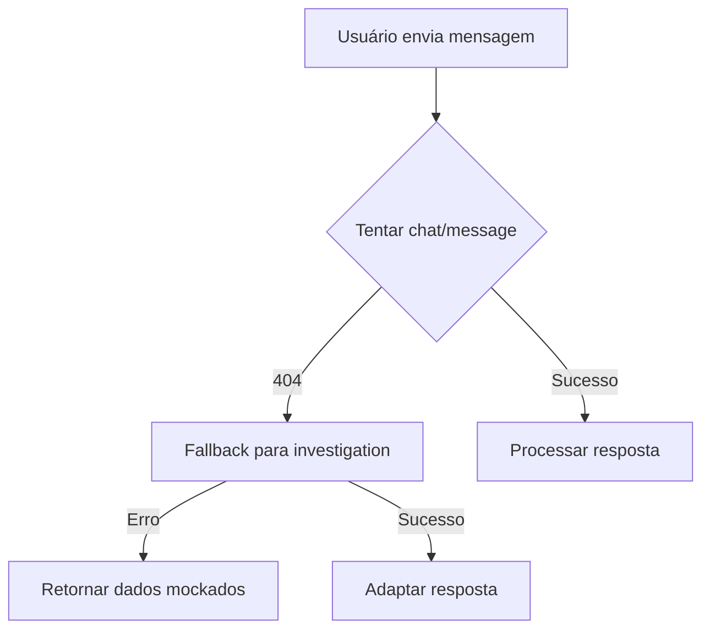
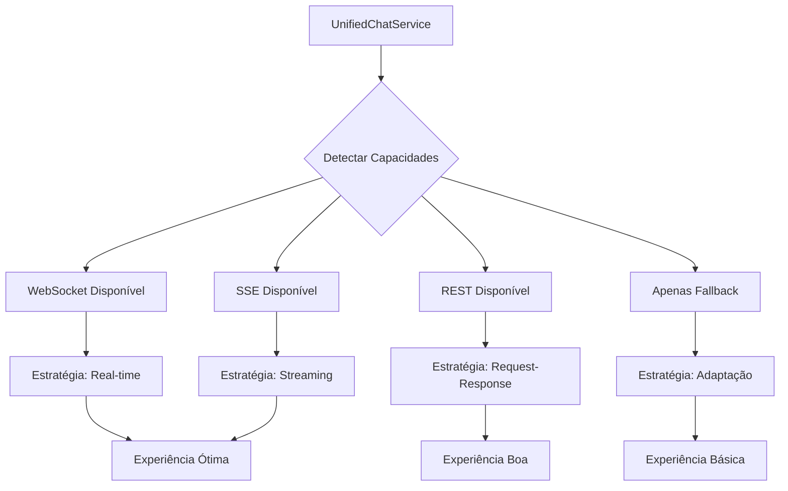

# RELATÓRIO DE INTEGRAÇÃO DO CHAT CONVERSACIONAL - CIDADÃO.AI

**Data:** 20 de Setembro de 2025  
**Hora:** 12:08:43 (Horário de São Paulo)  
**Autor:** Anderson Henrique da Silva  
**Tipo:** Análise Técnica e Roadmap de Implementação  
**Versão:** 1.0

---

## SUMÁRIO EXECUTIVO

Este relatório apresenta uma análise completa da situação atual da integração entre o frontend Next.js e o backend FastAPI do sistema de chat conversacional do Cidadão.AI, incluindo diagnóstico detalhado, roadmap de correções e estrutura de sprints para implementação.

### Situação Atual

- ❌ **Endpoints de chat retornando 404** no backend
- ✅ **Frontend completamente implementado** com WebSocket, SSE e REST
- ⚠️ **Sistema operando com fallbacks** e dados mockados
- 🔄 **Múltiplas camadas de adaptação** causando complexidade

### Impacto no Negócio

- Usuários não conseguem interagir com o agente Drummond
- Funcionalidade principal do sistema comprometida
- Experiência do usuário degradada com mensagens de erro

---

## 1. ANÁLISE TÉCNICA DETALHADA

### 1.1 Arquitetura Projetada vs Realidade

#### Backend (Prometido no Relatório)

```
Endpoints Documentados:
✓ POST   /api/v1/chat/message         # Chat principal
✓ POST   /api/v1/chat/stream          # Streaming SSE
✓ GET    /api/v1/chat/suggestions     # Sugestões rápidas
✓ GET    /api/v1/chat/history/{id}    # Histórico
✓ DELETE /api/v1/chat/history/{id}    # Limpar histórico
✓ WS     /api/v1/ws/chat/{session}    # WebSocket

Agente Principal:
- Carlos Drummond de Andrade (conversacional)
- Integrado com outros 16 agentes especializados
```

#### Frontend (Implementado)

```
Implementações Existentes:
✓ chat.service.ts       - Serviço principal com todos endpoints
✓ chat-adapter-v2.ts    - Adaptador para nova API
✓ chat-adapter.ts       - Fallback para investigation API
✓ chat-websocket.ts     - Cliente WebSocket completo
✓ use-chat.ts          - Hook React para estado do chat
✓ chat/page.tsx        - Interface completa do chat
```

### 1.2 Problemas Identificados

#### 1.2.1 Discrepância de Endpoints

```javascript
// Frontend tenta:
POST http://localhost:8000/api/v1/chat/message

// Resposta atual:
404 Not Found - Endpoint não encontrado

// Fallback ativo:
POST http://localhost:8000/api/v1/agents/abaporu/investigate
```

#### 1.2.2 Fluxo de Fallbacks



#### 1.2.3 WebSocket Não Utilizado

- Implementação completa mas desconectada
- Heartbeat e reconexão automática configurados
- Fila de mensagens offline implementada
- **Motivo:** Backend não responde no endpoint esperado

### 1.3 Análise de Código

#### Adapter V2 (Tentativa Principal)

```typescript
// lib/api/chat-adapter-v2.ts - Linha 57
const response = await api.post<ChatMessageResponse>('/api/v1/chat/message', payload)

// Tratamento de erro - Linha 96-97
if (error.response?.status === 404) {
  errorMessage = 'Endpoint de chat não encontrado. A API pode estar em atualização.'
}
```

#### Service Principal (Coordenação)

```typescript
// lib/api/chat.service.ts - Linha 35-36
// Use the new v2 adapter that calls the correct endpoint
const response = await sendChatMessage(request)

// Mocks em uso - Linhas 52-53, 62-63
return getMockSuggestions() // Sugestões mockadas
return getMockAgents() // Agentes mockados
```

---

## 2. ROADMAP DE IMPLEMENTAÇÃO

### 2.1 Visão Geral do Roadmap

```
Timeline: 6 Sprints (12 semanas)
Início: 22/09/2025
Fim: 15/12/2025

Sprint 1-2: Diagnóstico e Correções Críticas
Sprint 3-4: Implementação da Solução Unificada
Sprint 5: Otimizações e Performance
Sprint 6: Testes e Deploy
```

### 2.2 Estrutura Detalhada dos Sprints

---

## SPRINT 1: DIAGNÓSTICO E ESTABILIZAÇÃO

**Duração:** 2 semanas (22/09 - 05/10/2025)  
**Objetivo:** Estabelecer comunicação básica funcional

### Épicos e Tarefas

#### ÉPICO 1.1: Auditoria Completa do Backend

- [ ] Verificar implementação real dos endpoints de chat
- [ ] Testar todos os endpoints documentados
- [ ] Mapear discrepâncias entre documentação e realidade
- [ ] Criar relatório de status do backend

#### ÉPICO 1.2: Implementação Mínima Viável

- [ ] Criar endpoint `/api/v1/chat/message` se não existir
- [ ] Implementar resposta básica do Drummond
- [ ] Configurar CORS corretamente
- [ ] Adicionar logs detalhados

#### ÉPICO 1.3: Ajuste do Frontend

- [ ] Criar flag de feature para usar novo endpoint
- [ ] Manter fallback para investigation como backup
- [ ] Implementar retry logic com backoff
- [ ] Adicionar telemetria de erros

### Entregáveis Sprint 1

1. Relatório de auditoria do backend
2. Endpoint básico funcionando
3. Comunicação REST estabelecida
4. Métricas de erro implementadas

### Critérios de Sucesso

- Chat básico funcionando sem fallback
- Taxa de erro < 5%
- Tempo de resposta < 2s

---

## SPRINT 2: INTEGRAÇÃO COMPLETA REST

**Duração:** 2 semanas (06/10 - 19/10/2025)  
**Objetivo:** Implementar todos endpoints REST do chat

### Épicos e Tarefas

#### ÉPICO 2.1: Endpoints Completos

- [ ] Implementar `/api/v1/chat/suggestions`
- [ ] Implementar `/api/v1/chat/history/*`
- [ ] Implementar `/api/v1/chat/agents`
- [ ] Adicionar paginação no histórico

#### ÉPICO 2.2: Integração com Agentes

- [ ] Conectar Drummond com sistema de agentes
- [ ] Implementar roteamento inteligente
- [ ] Adicionar detecção de intenção
- [ ] Integrar com Abaporu (orquestrador)

#### ÉPICO 2.3: Persistência e Estado

- [ ] Implementar sessões de chat
- [ ] Adicionar cache Redis
- [ ] Criar sistema de contexto
- [ ] Implementar rate limiting

### Entregáveis Sprint 2

1. Todos endpoints REST funcionais
2. Sistema de sessões implementado
3. Integração com múltiplos agentes
4. Cache e persistência ativos

### Critérios de Sucesso

- 100% dos endpoints respondendo
- Sessões mantidas entre requisições
- Cache hit rate > 60%

---

## SPRINT 3: WEBSOCKET E TEMPO REAL

**Duração:** 2 semanas (20/10 - 02/11/2025)  
**Objetivo:** Ativar comunicação em tempo real

### Épicos e Tarefas

#### ÉPICO 3.1: Backend WebSocket

- [ ] Implementar endpoint WebSocket
- [ ] Adicionar sistema de rooms/sessões
- [ ] Implementar heartbeat/ping-pong
- [ ] Criar broadcast de eventos

#### ÉPICO 3.2: Frontend WebSocket

- [ ] Ativar cliente WebSocket existente
- [ ] Implementar reconexão automática
- [ ] Adicionar indicadores de status
- [ ] Sincronizar estado com REST

#### ÉPICO 3.3: Eventos em Tempo Real

- [ ] Notificações de agentes ativos
- [ ] Status de processamento
- [ ] Atualizações de investigação
- [ ] Typing indicators

### Entregáveis Sprint 3

1. WebSocket bidirecional funcionando
2. Reconexão automática robusta
3. Eventos em tempo real
4. Sincronização REST/WS

### Critérios de Sucesso

- Latência WebSocket < 100ms
- Reconexão em < 3s
- Zero perda de mensagens

---

## SPRINT 4: STREAMING E SSE

**Duração:** 2 semanas (03/11 - 16/11/2025)  
**Objetivo:** Implementar respostas em streaming

### Épicos e Tarefas

#### ÉPICO 4.1: Backend Streaming

- [ ] Implementar endpoint SSE
- [ ] Adicionar chunking de respostas
- [ ] Integrar com LLM streaming
- [ ] Implementar buffers

#### ÉPICO 4.2: Frontend Streaming

- [ ] Ativar cliente SSE existente
- [ ] Implementar renderização incremental
- [ ] Adicionar animações de digitação
- [ ] Gerenciar estados de streaming

#### ÉPICO 4.3: Experiência do Usuário

- [ ] Feedback visual durante streaming
- [ ] Cancelamento de requisições
- [ ] Retry em falhas de stream
- [ ] Progress indicators

### Entregáveis Sprint 4

1. Streaming SSE funcional
2. Respostas incrementais suaves
3. UX otimizada para streaming
4. Gestão de estados complexos

### Critérios de Sucesso

- Primeiro chunk < 500ms
- Streaming suave sem travamentos
- Capacidade de cancelamento

---

## SPRINT 5: OTIMIZAÇÃO E PERFORMANCE

**Duração:** 2 semanas (17/11 - 30/11/2025)  
**Objetivo:** Otimizar performance e confiabilidade

### Épicos e Tarefas

#### ÉPICO 5.1: Chat Service Unificado

- [ ] Implementar detector de capacidades
- [ ] Criar estratégia adaptativa
- [ ] Unificar interfaces
- [ ] Adicionar circuit breakers

#### ÉPICO 5.2: Otimizações

- [ ] Implementar request batching
- [ ] Otimizar bundle size
- [ ] Adicionar lazy loading
- [ ] Melhorar cache strategies

#### ÉPICO 5.3: Monitoramento

- [ ] Adicionar APM (Application Performance Monitoring)
- [ ] Implementar health checks
- [ ] Criar dashboards
- [ ] Alertas automáticos

### Entregáveis Sprint 5

1. Chat Service unificado
2. Performance otimizada
3. Monitoramento completo
4. Resiliência aumentada

### Critérios de Sucesso

- P95 latência < 1s
- Uptime > 99.9%
- Bundle size < 200KB

---

## SPRINT 6: TESTES E DEPLOY

**Duração:** 2 semanas (01/12 - 15/12/2025)  
**Objetivo:** Garantir qualidade e fazer deploy

### Épicos e Tarefas

#### ÉPICO 6.1: Testes Abrangentes

- [ ] Testes unitários (coverage > 80%)
- [ ] Testes de integração
- [ ] Testes E2E
- [ ] Testes de carga

#### ÉPICO 6.2: Documentação

- [ ] Atualizar CLAUDE.md
- [ ] Documentar APIs
- [ ] Criar guias de uso
- [ ] Documentar troubleshooting

#### ÉPICO 6.3: Deploy e Migração

- [ ] Preparar ambiente de produção
- [ ] Criar plano de rollback
- [ ] Deploy gradual (canary)
- [ ] Monitorar pós-deploy

### Entregáveis Sprint 6

1. Suite completa de testes
2. Documentação atualizada
3. Sistema em produção
4. Plano de contingência

### Critérios de Sucesso

- Zero bugs críticos
- Documentação completa
- Deploy sem incidentes
- Usuários satisfeitos

---

## 3. ARQUITETURA PROPOSTA

### 3.1 Chat Service Unificado

```typescript
// Proposta de implementação
class UnifiedChatService {
  private capabilities: ServiceCapabilities
  private strategy: CommunicationStrategy

  async detectCapabilities() {
    // Testa cada endpoint/protocolo
    // Determina melhor estratégia
  }

  async sendMessage(message: string) {
    switch (this.strategy) {
      case 'websocket':
        return this.sendViaWebSocket(message)
      case 'sse':
        return this.streamViaSSE(message)
      case 'rest':
        return this.sendViaREST(message)
      case 'fallback':
        return this.sendViaInvestigation(message)
    }
  }
}
```

### 3.2 Fluxo Otimizado



---

## 4. RISCOS E MITIGAÇÕES

### 4.1 Riscos Identificados

| Risco                                          | Probabilidade | Impacto | Mitigação              |
| ---------------------------------------------- | ------------- | ------- | ---------------------- |
| Backend não implementado conforme documentado  | Alta          | Alto    | Auditoria na Sprint 1  |
| Incompatibilidade de contratos de API          | Média         | Alto    | Testes de contrato     |
| Performance degradada com múltiplos protocolos | Média         | Médio   | Circuit breakers       |
| Complexidade de manutenção                     | Alta          | Médio   | Documentação detalhada |

### 4.2 Plano de Contingência

1. **Se backend não puder ser modificado:**
   - Criar BFF (Backend for Frontend) intermediário
   - Manter adaptadores no frontend

2. **Se WebSocket não funcionar:**
   - Priorizar SSE para tempo real
   - REST com polling como último recurso

3. **Se performance for inadequada:**
   - Implementar cache agressivo
   - Usar Web Workers para processamento

---

## 5. MÉTRICAS DE SUCESSO

### 5.1 KPIs Técnicos

- **Disponibilidade:** > 99.9%
- **Latência P50:** < 500ms
- **Latência P95:** < 1s
- **Taxa de Erro:** < 1%
- **Cache Hit Rate:** > 80%

### 5.2 KPIs de Negócio

- **Satisfação do Usuário:** > 4.5/5
- **Taxa de Conclusão de Chat:** > 80%
- **Tempo Médio de Resposta:** < 2s
- **Engajamento com Agentes:** > 60%

### 5.3 Monitoramento Contínuo

```javascript
// Exemplo de telemetria
const chatMetrics = {
  messagesSent: counter('chat.messages.sent'),
  messagesReceived: counter('chat.messages.received'),
  errors: counter('chat.errors'),
  latency: histogram('chat.latency'),
  activeConnections: gauge('chat.connections.active'),
  protocolUsed: counter('chat.protocol.used', ['protocol']),
}
```

---

## 6. RECOMENDAÇÕES FINAIS

### 6.1 Próximos Passos Imediatos

1. **Validar status real do backend** (até 22/09)
2. **Alinhar com equipe de backend** sobre implementação
3. **Iniciar Sprint 1** com foco em estabilização
4. **Estabelecer canal de comunicação** entre equipes

### 6.2 Decisões Críticas Necessárias

1. Priorizar WebSocket vs SSE vs REST?
2. Manter compatibilidade com investigation API?
3. Implementar BFF intermediário?
4. Estratégia de feature flags?

### 6.3 Considerações de Longo Prazo

1. **Versionamento de API** para evitar breaking changes
2. **Testes de contrato** entre frontend/backend
3. **Documentação viva** com exemplos
4. **Monitoramento proativo** de saúde

---

## APÊNDICES

### A. Código de Referência Atual

#### A.1 Tentativa de Conexão (Frontend)

```typescript
// lib/api/chat-adapter-v2.ts
const response = await api.post<ChatMessageResponse>('/api/v1/chat/message', payload)
```

#### A.2 Resposta Esperada (Backend)

```json
{
  "session_id": "123456",
  "agent_id": "drummond",
  "agent_name": "Carlos Drummond de Andrade",
  "message": "Olá! Como posso ajudá-lo hoje?",
  "confidence": 0.95,
  "suggested_actions": ["start_investigation", "learn_more"]
}
```

### B. Ferramentas e Tecnologias

- **Frontend:** Next.js 15, TypeScript, Zustand, Tailwind CSS
- **Backend:** FastAPI, Python 3.11+, SQLAlchemy, Redis
- **Protocolos:** REST, WebSocket, Server-Sent Events
- **Monitoramento:** Prometheus, Grafana, Sentry

### C. Contatos e Responsáveis

- **Autor:** Anderson Henrique da Silva
- **Frontend Lead:** [A definir]
- **Backend Lead:** [A definir]
- **Product Owner:** [A definir]

---

**FIM DO RELATÓRIO**

Documento gerado em: 20/09/2025 12:08:43 (São Paulo/Brasil)  
Versão: 1.0  
Status: FINAL
