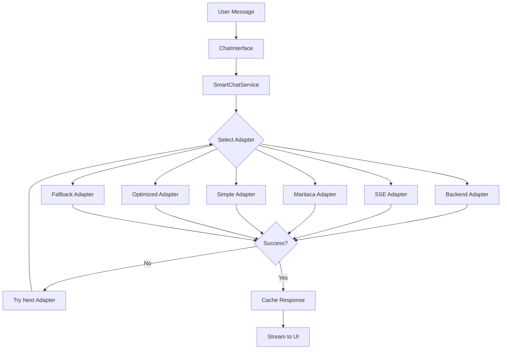
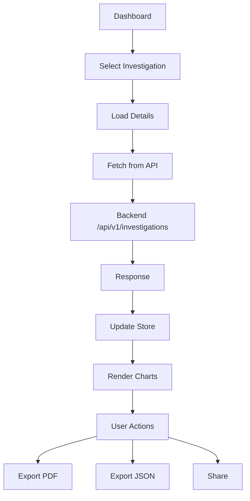
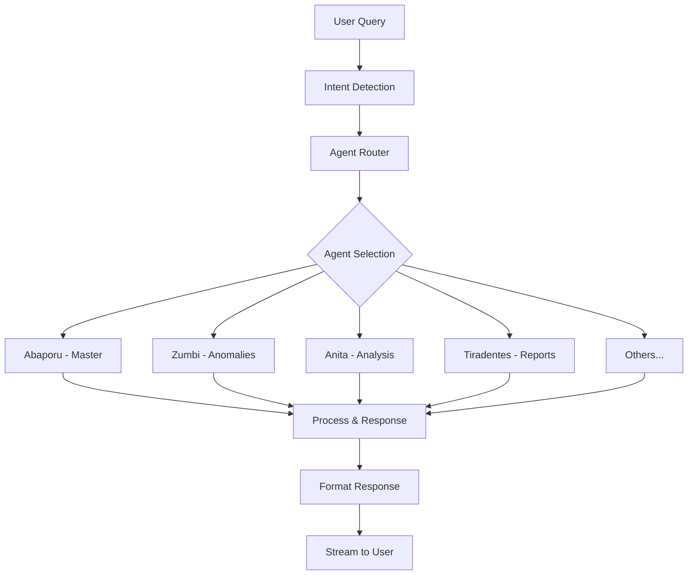
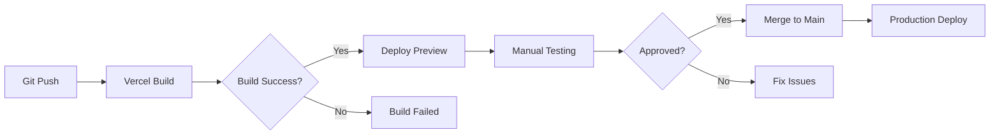

# 🔄 FLUXOS CRÍTICOS - CIDADÃO.AI FRONTEND

**Autor**: Anderson Henrique da Silva
**Localização**: Minas Gerais, Brasil
**Data de Criação**: 2025-10-31 15:20:00 -0300
**Branch**: consolidation-2025

---

## 📋 FLUXOS PRINCIPAIS DO SISTEMA

### 1. 🔐 FLUXO DE AUTENTICAÇÃO

```mermaid
graph TD
    A[User Access] --> B{Has Session?}
    B -->|No| C[/pt/login]
    B -->|Yes| D[Check Token]
    D -->|Invalid| C
    D -->|Valid| E[Protected Route]

    C --> F[OAuth Options]
    F --> G[Google OAuth]
    F --> H[GitHub OAuth]

    G --> I[Supabase Auth]
    H --> I
    I --> J[Create Session]
    J --> K[Redirect to /pt/app/home]
```

**Arquivos Críticos:**

- `app/auth/callback/route.ts` - OAuth callback handler
- `lib/supabase/server.ts` - Session management
- `middleware.ts` - Route protection

---

### 2. 💬 FLUXO DE CHAT (COMPLEXO DEMAIS!)



**Problema:** 6 adapters com lógica duplicada e difícil manutenção

**Arquivos Envolvidos:**

- `components/chat/chat-interface.tsx` - UI principal
- `lib/services/smart-chat.service.ts` - Seletor de adapters
- `lib/api/chat-adapter-*.ts` - 6 implementações diferentes
- `lib/services/chat-cache.service.ts` - Camada de cache
- `store/chat-store.ts` - Estado global do chat

---

### 3. 📊 FLUXO DE INVESTIGAÇÃO



**Arquivos Críticos:**

- `app/pt/(authenticated)/investigacoes/[id]/page.tsx`
- `lib/services/investigation.service.ts`
- `components/charts/investigation-charts.tsx`
- `lib/export/pdf-exporter.ts`

---

### 4. 🤖 FLUXO DE AGENTES



**Arquivos:**

- `data/agents.ts` - Definição dos 17 agentes
- `lib/api/agents.api.ts` - Comunicação com backend

---

## 🚨 PONTOS CRÍTICOS DE FALHA

### 1. Chat System

- **CRÍTICO**: Se o SmartChatService falhar, todo chat para
- **CRÍTICO**: Sem circuit breaker real entre adapters
- **PROBLEMA**: Cache não persiste entre refreshs

### 2. Authentication

- **PROBLEMA**: Session check em cada request (não cacheia)
- **PROBLEMA**: Redirect loops ocasionais

### 3. State Management

- **PROBLEMA**: Stores não versionados (breaking changes)
- **PROBLEMA**: Persist sem migração

### 4. API Communication

- **PROBLEMA**: Sem retry automático
- **PROBLEMA**: Timeout não configurado

---

## 📦 DEPENDÊNCIAS CRÍTICAS

### Core Dependencies

```json
{
  "next": "15.0.2", // App framework
  "react": "19.0.0-rc", // UI library
  "@supabase/ssr": "^0.5.1", // Auth
  "zustand": "^5.0.2", // State management
  "@serwist/next": "^10.0.5" // PWA (migrado recentemente)
}
```

### Heavy Dependencies (Problema de Bundle)

```json
{
  "d3": "^7.9.0", // 500KB+ (mal utilizado)
  "recharts": "^2.15.0", // 300KB+
  "jspdf": "^2.5.2", // 400KB+ (não lazy loaded)
  "html2canvas": "^1.4.1" // 200KB+
}
```

---

## 🔄 FLUXO DE BUILD E DEPLOY



**Problema:** Sem testes automatizados no CI!

---

## 📝 MAPEAMENTO DE ROTAS

### Public Routes (sem auth)

```
/pt/
├── login
├── about
├── agents
├── manifesto
├── privacy
└── terms
```

### Protected Routes (requer auth)

```
/pt/app/
├── home
├── chat
├── dashboard
├── investigacoes
│   └── [id]
├── perfil
├── notificacoes
├── configuracoes
└── help
```

### API Routes

```
/api/
└── telemetry/
    └── events
```

---

## 🎯 FLUXOS A SIMPLIFICAR

### Prioridade 1 - Chat

- Reduzir de 6 para 2 adapters
- Eliminar SmartChatService
- Cache mais inteligente

### Prioridade 2 - Auth

- Cache de session
- Melhor handling de redirects

### Prioridade 3 - State

- Versionamento de stores
- Migrations automáticas

---

## 📊 MÉTRICAS DE USO (Estimadas)

### Fluxos Mais Usados

1. **Chat com agentes** - 70% do uso
2. **Dashboard** - 20% do uso
3. **Investigações detalhadas** - 10% do uso

### Pontos de Abandono

1. **Login** - 30% desistem (OAuth confuso?)
2. **Chat** - 15% após primeira mensagem (lento?)
3. **Export** - 40% falha (bundle pesado?)

---

**Status**: DOCUMENTADO ✅
**Próximo**: Iniciar FASE 1 - Fundação (Testes + TypeScript)
