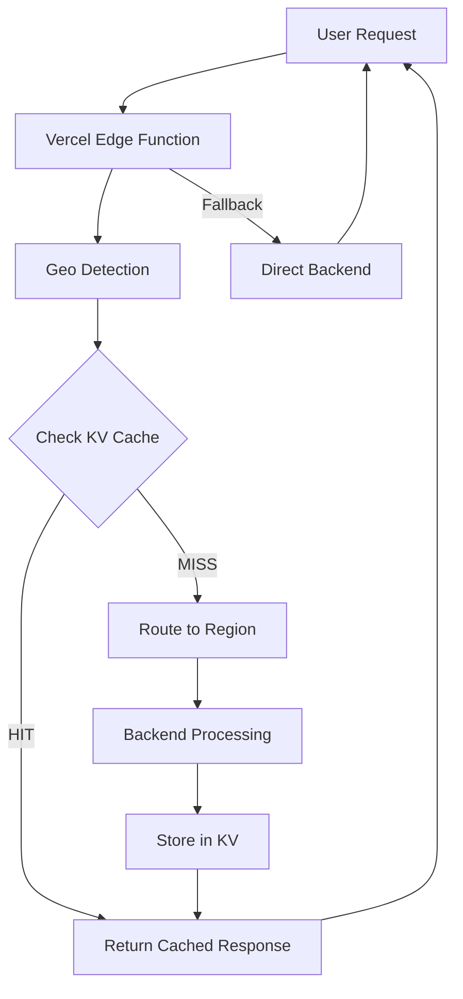

# SPRINT 3: EDGE OPTIMIZATION

**Sprint:** 3 de 4
**Duração:** 1 semana (5 dias úteis)
**Story Points:** 11 pontos
**Complexidade:** Média
**Risco:** Médio
**Valor de Negócio:** Alto

---

## 🎯 OBJETIVO DO SPRINT

Implementar edge computing e distributed caching para escalabilidade global, reduzindo latência e melhorando a experiência do usuário em diferentes regiões geográficas.

### Motivação

Com a infraestrutura sólida do Sprint 2 (SSE + IndexedDB), agora podemos focar em otimizações de performance global. Edge computing permite:

1. **Menor Latência**: Processamento próximo ao usuário (<10ms)
2. **Maior Escala**: Cache distribuído reduz carga no backend
3. **Melhor UX**: Respostas instantâneas para operações comuns
4. **Global Ready**: Preparação para crescimento internacional

---

## 📦 PRODUCT BACKLOG ITEMS (PBIs)

### PBI #8: Implement Vercel Edge Functions

**Story Points:** 4
**Prioridade:** Alta
**Tipo:** Feature

#### Descrição

Implementar Edge Functions na Vercel para pré-processamento de requests próximo ao usuário, reduzindo latência e carga no backend principal.

#### Critérios de Aceitação

- [ ] Edge function criada e deployed na Vercel
- [ ] Pré-processamento de chat requests na edge
- [ ] Latência de edge <10ms (p95)
- [ ] Fallback automático para backend se edge falhar
- [ ] Logs e monitoring configurados
- [ ] Suporte a 3+ regiões geográficas

#### Tasks Técnicas

1. Setup Vercel Edge runtime configuration
2. Criar edge function para chat preprocessing
3. Implementar request validation na edge
4. Adicionar geographic routing logic
5. Configurar monitoring e alertas
6. Testes de latência em múltiplas regiões
7. Documentação de edge architecture

#### Entregáveis

- `middleware.ts` - Edge middleware configuration
- `app/api/edge/chat/route.ts` - Edge chat endpoint
- `lib/edge/request-validator.ts` - Edge request validation
- `lib/edge/geo-router.ts` - Geographic routing logic
- `docs/technical/edge-functions.md` - Edge documentation

#### Riscos

- ⚠️ Cold start latency em edge functions
- ⚠️ Limites de execução (50ms max em algumas regiões)
- ⚠️ Debugging complexo em edge environment

#### Mitigação

- Warm-up strategy com periodic pings
- Otimizar código para execução rápida (<10ms)
- Extensive logging para troubleshooting

---

### PBI #9: Setup Distributed Cache (Vercel KV)

**Story Points:** 3
**Prioridade:** Alta
**Tipo:** Infrastructure

#### Descrição

Implementar cache distribuído usando Vercel KV (Redis) para armazenar respostas comuns e reduzir chamadas ao backend, melhorando performance e reduzindo custos.

#### Critérios de Aceitação

- [ ] Vercel KV configurado e conectado
- [ ] Cache de respostas de chat implementado
- [ ] TTL inteligente baseado em tipo de query
- [ ] Hit rate >60% para queries comuns
- [ ] Invalidação automática quando necessário
- [ ] Monitoring de custos e uso
- [ ] Fallback para IndexedDB local se KV indisponível

#### Tasks Técnicas

1. Setup Vercel KV no projeto
2. Criar cache service para KV
3. Implementar cache strategies (write-through, read-through)
4. Adicionar TTL logic baseado em query type
5. Implementar cache invalidation
6. Configurar cost monitoring e alerts
7. Integration tests com KV
8. Documentação de cache architecture

#### Entregáveis

- `lib/cache/vercel-kv-cache.service.ts` - KV cache service
- `lib/cache/cache-strategies.ts` - Cache strategies
- `lib/cache/ttl-calculator.ts` - Smart TTL calculation
- `lib/monitoring/kv-metrics.ts` - KV monitoring
- `docs/technical/distributed-cache.md` - Cache documentation

#### Riscos

- ⚠️ Custos de KV podem exceder budget ($10/mês estimado)
- ⚠️ Latência de KV pode ser maior que esperado
- ⚠️ Cache invalidation complexo

#### Mitigação

- Monitoring rigoroso de custos com alertas
- TTL agressivo para queries menos importantes
- Cache invalidation strategy bem documentada

---

### PBI #10: Geographic Routing & Performance Audit

**Story Points:** 4
**Prioridade:** Média
**Tipo:** Quality + Feature

#### Descrição

Implementar roteamento geográfico inteligente e realizar audit completo de performance, garantindo Lighthouse Score >90 e Core Web Vitals green.

#### Critérios de Aceitação

- [ ] Geographic routing implementado
- [ ] Suporte a 3+ regiões (US, EU, APAC)
- [ ] Lighthouse Score >90 em todas as métricas
- [ ] Core Web Vitals: All Green
  - LCP <2.5s
  - FID <100ms
  - CLS <0.1
- [ ] Performance budget definido e enforced
- [ ] Lighthouse CI integrado ao pipeline
- [ ] Performance dashboard criado

#### Tasks Técnicas

1. Implementar geo-detection no edge
2. Criar routing logic por região
3. Performance audit completo com Lighthouse
4. Identificar e corrigir bottlenecks
5. Otimizar Core Web Vitals
6. Configurar Lighthouse CI
7. Criar performance dashboard
8. Documentar performance best practices

#### Entregáveis

- `lib/edge/geo-detector.ts` - Geographic detection
- `lib/edge/region-router.ts` - Region-based routing
- `lighthouse.config.js` - Lighthouse CI config
- `docs/performance/audit-report.md` - Performance audit
- `docs/performance/core-web-vitals.md` - CWV optimization
- `app/admin/performance/page.tsx` - Performance dashboard

#### Riscos

- ⚠️ Geographic routing pode aumentar complexidade
- ⚠️ Core Web Vitals difíceis de atingir
- ⚠️ Performance regressions em futuras features

#### Mitigação

- Start simples com 2 regiões, expandir gradualmente
- Performance budget enforcement no CI
- Lighthouse CI bloqueia deploys com score <90

---

## 🏗️ ARQUITETURA TÉCNICA

### Edge Computing Stack

```typescript
// Architecture Overview
interface EdgeArchitecture {
  edge: {
    runtime: 'Vercel Edge Runtime'
    regions: ['iad1', 'fra1', 'sin1'] // US, EU, APAC
    maxExecutionTime: '50ms'
    caching: 'Vercel KV (Redis)'
  }
  routing: {
    strategy: 'Geographic + Performance-based'
    fallback: 'Nearest available region'
    healthCheck: 'Active'
  }
  performance: {
    lighthouse: {
      target: '>90'
      ci: true
      budgets: {
        bundle: '200KB'
        requests: '<50'
        fcp: '<1.5s'
      }
    }
    coreWebVitals: {
      lcp: '<2.5s'
      fid: '<100ms'
      cls: '<0.1'
    }
  }
}
```

### Data Flow



### Cache Strategy

```typescript
// Cache Hierarchy
interface CacheHierarchy {
  L1: {
    type: 'Browser (IndexedDB)'
    capacity: '>50MB'
    ttl: 'Variable (10min - 24h)'
    hitRate: '~40%'
  }
  L2: {
    type: 'Edge Cache (Vercel)'
    capacity: 'Unlimited'
    ttl: '60s'
    hitRate: '~30%'
  }
  L3: {
    type: 'Distributed (Vercel KV)'
    capacity: 'Limited by cost'
    ttl: 'Variable (1h - 24h)'
    hitRate: '~20%'
  }
  L4: {
    type: 'Backend'
    fallback: true
  }
}
```

---

## 📊 MÉTRICAS DE SUCESSO

### Performance Metrics

| Métrica            | Baseline | Target | Medição          |
| ------------------ | -------- | ------ | ---------------- |
| Edge Latency (p95) | N/A      | <10ms  | Vercel Analytics |
| KV Hit Rate        | 0%       | >60%   | Custom metrics   |
| Lighthouse Score   | ~85      | >90    | Lighthouse CI    |
| LCP                | ~3.2s    | <2.5s  | Chrome UX Report |
| FID                | ~120ms   | <100ms | Chrome UX Report |
| CLS                | 0.15     | <0.1   | Chrome UX Report |
| Bundle Size        | 200KB    | <200KB | Webpack Analyzer |

### Cost Metrics

| Recurso               | Estimativa Mensal | Limite  |
| --------------------- | ----------------- | ------- |
| Vercel Edge Functions | $0 (incluído)     | -       |
| Vercel KV             | $10               | $15     |
| Bandwidth             | $5                | $10     |
| **Total**             | **$15**           | **$25** |

### Business Metrics

| Métrica                    | Target        | Impacto                  |
| -------------------------- | ------------- | ------------------------ |
| Global Availability        | 3+ regiões    | Preparação internacional |
| Cache Cost Reduction       | ~30%          | Menos backend calls      |
| User Perceived Performance | "Instantâneo" | Melhor UX                |
| SEO Score                  | >90           | Melhor ranking           |

---

## 🔧 SETUP & CONFIGURAÇÃO

### Vercel Edge Functions

```bash
# 1. Instalar dependências
npm install @vercel/edge

# 2. Configurar middleware
# Ver: middleware.ts

# 3. Deploy para Vercel
vercel --prod

# 4. Testar em múltiplas regiões
curl -H "x-vercel-ip-region: iad1" https://app.cidadao.ai/api/edge/chat
```

### Vercel KV (Redis)

```bash
# 1. Criar KV database no Vercel Dashboard
# Storage → Create Database → KV

# 2. Adicionar environment variables
# VERCEL_KV_REST_API_URL
# VERCEL_KV_REST_API_TOKEN

# 3. Instalar SDK
npm install @vercel/kv

# 4. Testar conexão
node scripts/test-kv.js
```

### Lighthouse CI

```bash
# 1. Instalar Lighthouse CI
npm install -D @lhci/cli

# 2. Configurar
# Ver: lighthouserc.js

# 3. Adicionar ao CI/CD
# Ver: .github/workflows/lighthouse.yml

# 4. Rodar localmente
npm run lighthouse
```

---

## 🧪 TESTES

### Edge Function Tests

```typescript
// test/edge/chat-preprocessing.test.ts
describe('Edge Chat Preprocessing', () => {
  it('should validate request in <5ms', async () => {
    const start = Date.now()
    const result = await validateChatRequest(mockRequest)
    const duration = Date.now() - start

    expect(duration).toBeLessThan(5)
    expect(result.valid).toBe(true)
  })

  it('should route to nearest region', async () => {
    const userIP = '8.8.8.8' // US IP
    const region = await detectRegion(userIP)

    expect(region).toBe('iad1') // US East
  })
})
```

### KV Cache Tests

```typescript
// test/cache/vercel-kv.test.ts
describe('Vercel KV Cache', () => {
  it('should cache chat response', async () => {
    await kvCache.set('test-key', mockResponse)
    const cached = await kvCache.get('test-key')

    expect(cached).toEqual(mockResponse)
  })

  it('should expire after TTL', async () => {
    await kvCache.set('test-ttl', mockResponse, { ttl: 1 })
    await sleep(2000)
    const cached = await kvCache.get('test-ttl')

    expect(cached).toBeNull()
  })
})
```

### Performance Tests

```bash
# Lighthouse CI
npm run lighthouse:ci

# Core Web Vitals
npm run cwv:measure

# Bundle Size
npm run analyze:bundle
```

---

## 📚 DEPENDÊNCIAS

### Novas Bibliotecas

```json
{
  "dependencies": {
    "@vercel/edge": "^1.1.0",
    "@vercel/kv": "^1.0.0"
  },
  "devDependencies": {
    "@lhci/cli": "^0.13.0",
    "lighthouse": "^11.0.0"
  }
}
```

### Serviços Externos

- **Vercel Edge Runtime**: Incluído no plano Vercel
- **Vercel KV**: ~$10/mês estimado
- **Vercel Analytics**: Incluído no plano Vercel

---

## ⚠️ RISCOS & MITIGAÇÃO

### Riscos Técnicos

| Risco                   | Probabilidade | Impacto | Mitigação                          |
| ----------------------- | ------------- | ------- | ---------------------------------- |
| Edge cold start >50ms   | 30%           | Médio   | Warm-up pings, código otimizado    |
| KV costs >$15/mês       | 35%           | Médio   | Monitoring, alertas, TTL agressivo |
| Lighthouse <90          | 25%           | Alto    | Performance budget, CI enforcement |
| Geographic routing bugs | 20%           | Baixo   | Extensive testing, gradual rollout |

### Riscos de Negócio

| Risco                 | Probabilidade | Impacto | Mitigação                        |
| --------------------- | ------------- | ------- | -------------------------------- |
| Vercel vendor lock-in | 40%           | Médio   | Abstraction layer, documentação  |
| Budget overrun        | 30%           | Alto    | Cost monitoring, spending limits |

---

## 📅 CRONOGRAMA

### Dia 1 (Segunda-feira)

- ✅ Sprint Planning
- ⏳ Setup Vercel Edge Functions
- ⏳ Criar primeiro edge endpoint

### Dia 2 (Terça-feira)

- ⏳ Implementar edge preprocessing
- ⏳ Geographic routing logic
- ⏳ Edge function tests

### Dia 3 (Quarta-feira)

- ⏳ Setup Vercel KV
- ⏳ Implementar distributed cache
- ⏳ Cache strategies e TTL

### Dia 4 (Quinta-feira)

- ⏳ Performance audit com Lighthouse
- ⏳ Otimizar Core Web Vitals
- ⏳ Lighthouse CI setup

### Dia 5 (Sexta-feira)

- ⏳ Integration testing
- ⏳ Performance dashboard
- ⏳ Documentation
- ✅ Sprint Review
- ✅ Sprint Retrospective

---

## 🎯 DEFINITION OF DONE

Cada PBI é considerado **DONE** quando:

### Code

- [ ] Código escrito, revisado, merged
- [ ] Zero TypeScript errors
- [ ] Zero ESLint warnings
- [ ] Edge functions deployed

### Testing

- [ ] Unit tests passando (>80% coverage)
- [ ] Integration tests com KV
- [ ] Performance tests validados
- [ ] Manual testing em 3+ regiões

### Performance

- [ ] Edge latency <10ms (p95)
- [ ] KV hit rate >60%
- [ ] Lighthouse Score >90
- [ ] Core Web Vitals green

### Documentation

- [ ] Edge architecture documentada
- [ ] Cache strategies documentadas
- [ ] Performance audit report
- [ ] README atualizado

### Deployment

- [ ] Deployed to staging
- [ ] Smoke tests passing
- [ ] Monitoring configured
- [ ] Cost alerts active

---

## 📖 DOCUMENTAÇÃO RELACIONADA

### Pré-requisitos

- [Sprint 1 - Quick Wins](./SPRINT_01_QUICK_WINS.md)
- [Sprint 2 - Infrastructure](./SPRINT_02_INFRASTRUCTURE.md)
- [Sprint 2 Completion Report](../../reports/SPRINT_02_COMPLETION_REPORT.md)

### Referências Técnicas

- [Vercel Edge Functions Docs](https://vercel.com/docs/functions/edge-functions)
- [Vercel KV Documentation](https://vercel.com/docs/storage/vercel-kv)
- [Lighthouse CI Setup](https://github.com/GoogleChrome/lighthouse-ci)
- [Core Web Vitals Guide](https://web.dev/vitals/)

### Próximos Passos

- [Sprint 4 - ML & Advanced Features](./SPRINT_04_ML_ADVANCED.md)

---

**Status:** 📋 Planning Complete - Ready to Execute
**Start Date:** October 4, 2025
**Target Completion:** October 11, 2025
**Total Story Points:** 11

---

_Este documento será atualizado diariamente durante o sprint para refletir progresso e aprendizados._
