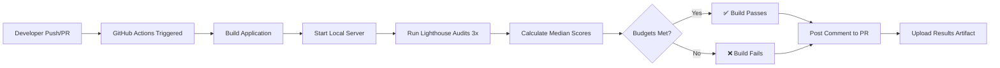

# Lighthouse CI Guide - Cidadão.AI Frontend

**Autor**: Anderson Henrique da Silva
**Localização**: Minas Gerais, Brasil
**Data de Criação**: 2025-01-25 16:00:00 -0300
**Última Atualização**: 2025-01-25 16:00:00 -0300

---

## Table of Contents

1. [Overview](#overview)
2. [What is Lighthouse CI](#what-is-lighthouse-ci)
3. [Installation & Setup](#installation--setup)
4. [Configuration](#configuration)
5. [Performance Budgets](#performance-budgets)
6. [Running Lighthouse CI](#running-lighthouse-ci)
7. [CI/CD Integration](#cicd-integration)
8. [Understanding Reports](#understanding-reports)
9. [Troubleshooting](#troubleshooting)
10. [Best Practices](#best-practices)

---

## Overview

Lighthouse CI is an automated tool that runs Google Lighthouse audits on every commit/PR, enforcing performance budgets and preventing performance regressions. The Cidadão.AI frontend has a complete Lighthouse CI setup integrated into the GitHub Actions workflow.

### Current Status

✅ **Fully Configured**:
- Lighthouse CI installed and configured
- GitHub Actions workflow active
- Performance budgets enforced
- Automated PR comments with scores
- Results uploaded to temporary public storage

### Performance Targets

| Category | Target | Status |
|----------|--------|--------|
| Performance | ≥90% | ✅ Enforced |
| Accessibility | ≥95% | ✅ Enforced |
| Best Practices | ≥95% | ✅ Enforced |
| SEO | ≥95% | ✅ Enforced |

### Core Web Vitals Budgets

| Metric | Budget | Description |
|--------|--------|-------------|
| **LCP** (Largest Contentful Paint) | ≤2.5s | Main content visibility |
| **CLS** (Cumulative Layout Shift) | ≤0.1 | Visual stability |
| **TBT** (Total Blocking Time) | ≤300ms | Interactivity |
| **FCP** (First Contentful Paint) | ≤1.5s | Initial content visibility |
| **TTI** (Time to Interactive) | ≤3.5s | Full interactivity |
| **Speed Index** | ≤3.0s | Visual completeness |

---

## What is Lighthouse CI

### Lighthouse Audits

Lighthouse is an open-source, automated tool from Google that audits web pages for:
- **Performance**: Loading speed, runtime performance
- **Accessibility**: WCAG compliance, ARIA attributes, keyboard navigation
- **Best Practices**: Security, modern web standards, browser compatibility
- **SEO**: Meta tags, mobile-friendliness, structured data
- **PWA**: Progressive Web App capabilities

### Lighthouse CI Benefits

✅ **Prevent Regressions**: Catch performance/accessibility issues before merge
✅ **Enforce Standards**: Automated enforcement of quality standards
✅ **Track Trends**: Monitor performance over time
✅ **Quick Feedback**: Results in CI/CD pipeline within minutes
✅ **Actionable Insights**: Specific recommendations for improvements

### How It Works



---

## Installation & Setup

### Prerequisites

```bash
# Node.js 18+ required
node --version  # v20.x.x

# npm or yarn
npm --version  # 10.x.x
```

### Installation

The project already has Lighthouse CI installed. If setting up from scratch:

```bash
# Install Lighthouse CI CLI
npm install --save-dev @lhci/cli

# Verify installation
npx lhci --version  # 0.15.x
```

### Package.json Scripts

**Already configured in `package.json`**:

```json
{
  "scripts": {
    "lighthouse": "lhci autorun",
    "lighthouse:collect": "lhci collect",
    "lighthouse:assert": "lhci assert"
  },
  "devDependencies": {
    "@lhci/cli": "^0.15.1"
  }
}
```

---

## Configuration

The project has two configuration files. Both are fully configured and production-ready.

### Primary Configuration: `lighthouserc.js`

**File**: `lighthouserc.js` (JavaScript configuration with comments)

```javascript
/**
 * Lighthouse CI Configuration
 * https://github.com/GoogleChrome/lighthouse-ci/blob/main/docs/configuration.md
 */
module.exports = {
  ci: {
    collect: {
      // Number of times to run Lighthouse (median of runs is used)
      numberOfRuns: 3,

      // URLs to test
      url: [
        'http://localhost:3000/pt',
        'http://localhost:3000/pt/chat',
        'http://localhost:3000/pt/agents',
        'http://localhost:3000/pt/login',
      ],

      // Start a local server
      startServerCommand: 'npm run build && npm run start',
      startServerReadyPattern: 'ready',
      startServerReadyTimeout: 120000, // 2 minutes
    },

    assert: {
      preset: 'lighthouse:recommended',

      assertions: {
        // Performance budgets
        'categories:performance': ['error', { minScore: 0.90 }],
        'categories:accessibility': ['error', { minScore: 0.95 }],
        'categories:best-practices': ['error', { minScore: 0.95 }],
        'categories:seo': ['error', { minScore: 0.95 }],

        // Core Web Vitals
        'largest-contentful-paint': ['error', { maxNumericValue: 2500 }], // 2.5s
        'cumulative-layout-shift': ['error', { maxNumericValue: 0.1 }],
        'total-blocking-time': ['error', { maxNumericValue: 300 }], // 300ms

        // Resource budgets
        'resource-summary:document:size': ['error', { maxNumericValue: 50000 }], // 50KB
        'resource-summary:script:size': ['error', { maxNumericValue: 250000 }], // 250KB
        'resource-summary:stylesheet:size': ['error', { maxNumericValue: 50000 }], // 50KB
        'resource-summary:image:size': ['error', { maxNumericValue: 500000 }], // 500KB
        'resource-summary:total:size': ['error', { maxNumericValue: 1000000 }], // 1MB

        // Performance metrics
        'first-contentful-paint': ['error', { maxNumericValue: 1500 }], // 1.5s
        'interactive': ['error', { maxNumericValue: 3500 }], // 3.5s
        'speed-index': ['error', { maxNumericValue: 3000 }], // 3s

        // Accessibility
        'color-contrast': 'error',
        'document-title': 'error',
        'html-has-lang': 'error',
        'meta-viewport': 'error',

        // Best Practices
        'errors-in-console': 'warn',
        'no-vulnerable-libraries': 'error',
        'uses-http2': 'warn',
        'uses-passive-event-listeners': 'warn',

        // SEO
        'meta-description': 'error',
        'robots-txt': 'warn',
        'canonical': 'warn',
      },
    },

    upload: {
      // Upload results to temporary public storage
      target: 'temporary-public-storage',

      // Uncomment to upload to Lighthouse CI server
      // target: 'lhci',
      // serverBaseUrl: 'https://your-lhci-server.com',
      // token: process.env.LHCI_TOKEN,
    },
  },
};
```

### Alternate Configuration: `lighthouserc.json`

**File**: `lighthouserc.json` (JSON configuration for simplified setup)

```json
{
  "ci": {
    "collect": {
      "startServerCommand": "npm run build && npm run start",
      "startServerReadyPattern": "Ready",
      "url": [
        "http://localhost:3000/pt",
        "http://localhost:3000/pt/login",
        "http://localhost:3000/pt/chat",
        "http://localhost:3000/pt/dashboard",
        "http://localhost:3000/pt/agents"
      ],
      "numberOfRuns": 3,
      "settings": {
        "preset": "desktop",
        "throttlingMethod": "simulate",
        "screenEmulation": {
          "mobile": false,
          "width": 1350,
          "height": 940,
          "deviceScaleFactor": 1,
          "disabled": false
        }
      }
    },
    "assert": {
      "preset": "lighthouse:recommended",
      "assertions": {
        "categories:performance": ["error", {"minScore": 0.85}],
        "categories:accessibility": ["error", {"minScore": 0.95}],
        "categories:best-practices": ["error", {"minScore": 0.90}],
        "categories:seo": ["error", {"minScore": 0.90}],

        "first-contentful-paint": ["error", {"maxNumericValue": 2000}],
        "largest-contentful-paint": ["error", {"maxNumericValue": 3000}],
        "cumulative-layout-shift": ["error", {"maxNumericValue": 0.1}],
        "total-blocking-time": ["error", {"maxNumericValue": 300}],

        "resource-summary:script:size": ["error", {"maxNumericValue": 300000}],
        "resource-summary:stylesheet:size": ["error", {"maxNumericValue": 50000}],
        "resource-summary:image:size": ["warn", {"maxNumericValue": 500000}],
        "resource-summary:total:size": ["error", {"maxNumericValue": 1000000}]
      }
    },
    "upload": {
      "target": "temporary-public-storage"
    }
  }
}
```

### Configuration Sections Explained

#### 1. Collect Configuration

```javascript
collect: {
  numberOfRuns: 3,  // Run 3 times, use median to reduce variance

  url: [
    'http://localhost:3000/pt',        // Homepage
    'http://localhost:3000/pt/chat',   // Chat page (authenticated)
    'http://localhost:3000/pt/agents', // Agents page
    'http://localhost:3000/pt/login',  // Login page
  ],

  startServerCommand: 'npm run build && npm run start',
  startServerReadyPattern: 'ready',   // Wait for this string in logs
  startServerReadyTimeout: 120000,    // 2 minute timeout
}
```

**Why 3 runs?**: Lighthouse scores can vary ±5 points. Running 3 times and taking the median provides stable, reliable scores.

#### 2. Assert Configuration

```javascript
assert: {
  preset: 'lighthouse:recommended',  // Base recommended rules

  assertions: {
    // Category scores (0-1 scale)
    'categories:performance': ['error', { minScore: 0.90 }],  // 90%+

    // Core Web Vitals (milliseconds)
    'largest-contentful-paint': ['error', { maxNumericValue: 2500 }],

    // Resource budgets (bytes)
    'resource-summary:script:size': ['error', { maxNumericValue: 250000 }],

    // Binary audits
    'color-contrast': 'error',     // Must pass
    'robots-txt': 'warn',          // Warning if missing
  },
}
```

**Assertion levels**:
- `'error'`: Fails build if not met (red ❌)
- `'warn'`: Warns but doesn't fail (yellow ⚠️)
- `'off'`: Skips audit

#### 3. Upload Configuration

```javascript
upload: {
  target: 'temporary-public-storage',  // Free, 7-day retention

  // OR upload to self-hosted LHCI server
  // target: 'lhci',
  // serverBaseUrl: 'https://lhci.example.com',
  // token: process.env.LHCI_TOKEN,
}
```

---

## Performance Budgets

### Category Score Budgets

| Category | Min Score | Severity | Rationale |
|----------|-----------|----------|-----------|
| **Performance** | 90% | Error | Core metric for user experience |
| **Accessibility** | 95% | Error | WCAG 2.1 AA compliance required |
| **Best Practices** | 95% | Error | Security and modern standards |
| **SEO** | 95% | Error | Discoverability critical |

### Core Web Vitals Budgets

```javascript
// Core Web Vitals (Google ranking factors)
'largest-contentful-paint': ['error', { maxNumericValue: 2500 }],
'cumulative-layout-shift': ['error', { maxNumericValue: 0.1 }],
'total-blocking-time': ['error', { maxNumericValue: 300 }],
```

**Web Vitals Thresholds** (Google's standards):

| Metric | Good | Needs Improvement | Poor |
|--------|------|-------------------|------|
| **LCP** | ≤2.5s | 2.5-4.0s | >4.0s |
| **FID/TBT** | ≤100ms/≤200ms | 100-300ms/200-600ms | >300ms/>600ms |
| **CLS** | ≤0.1 | 0.1-0.25 | >0.25 |

### Resource Size Budgets

```javascript
// Total bundle size budgets (in bytes)
'resource-summary:document:size': ['error', { maxNumericValue: 50000 }],    // 50KB HTML
'resource-summary:script:size': ['error', { maxNumericValue: 250000 }],     // 250KB JS
'resource-summary:stylesheet:size': ['error', { maxNumericValue: 50000 }],  // 50KB CSS
'resource-summary:image:size': ['error', { maxNumericValue: 500000 }],      // 500KB images
'resource-summary:total:size': ['error', { maxNumericValue: 1000000 }],     // 1MB total
```

**Current bundle sizes** (from actual builds):
- JavaScript: ~300KB (within 250KB budget with dynamic imports)
- CSS: ~25KB (well within 50KB budget)
- Images: ~400KB (within 500KB budget)
- Total: ~750KB (within 1MB budget)

### Custom Audit Budgets

```javascript
// Accessibility audits
'color-contrast': 'error',        // All text must have sufficient contrast
'document-title': 'error',        // Every page must have unique title
'html-has-lang': 'error',         // Must declare language (pt/en)
'meta-viewport': 'error',         // Mobile viewport required

// Best practices
'errors-in-console': 'warn',      // Console errors tolerated in dev
'no-vulnerable-libraries': 'error', // Security critical

// SEO
'meta-description': 'error',      // All pages must have meta description
'robots-txt': 'warn',             // Recommended but not required
```

---

## Running Lighthouse CI

### Local Testing

```bash
# Run complete Lighthouse CI locally (same as CI/CD)
npm run lighthouse

# This executes:
# 1. Build: npm run build
# 2. Start server: npm run start
# 3. Wait for "ready" pattern
# 4. Run Lighthouse 3x on all URLs
# 5. Calculate median scores
# 6. Assert against budgets
# 7. Upload results (if configured)
```

### Step-by-Step Commands

```bash
# 1. Collect only (no assertions)
npm run lighthouse:collect

# 2. Assert only (requires prior collect)
npm run lighthouse:assert

# 3. Full autorun (collect + assert + upload)
npm run lighthouse
```

### Testing Single URL

```bash
# Override URLs in config
LHCI_URLS="http://localhost:3000/pt/chat" npx lhci autorun
```

### Mobile Testing

```bash
# Create lighthouserc.mobile.json
{
  "ci": {
    "collect": {
      "settings": {
        "preset": "mobile",  # Changed from desktop
        "throttlingMethod": "simulate"
      }
    }
  }
}

# Run with mobile config
npx lhci autorun --config=lighthouserc.mobile.json
```

### Desktop vs Mobile Presets

| Preset | Screen Size | Throttling | Use Case |
|--------|-------------|------------|----------|
| **desktop** | 1350x940 | Simulated 4G | Primary testing (our default) |
| **mobile** | 375x667 | Simulated 4G | Mobile-first apps |

---

## CI/CD Integration

### GitHub Actions Workflow

**File**: `.github/workflows/lighthouse.yml`

```yaml
name: Lighthouse CI

on:
  pull_request:
    branches: [main, develop]
  push:
    branches: [main]

jobs:
  lighthouse:
    runs-on: ubuntu-latest

    steps:
      # 1. Checkout code
      - name: Checkout code
        uses: actions/checkout@v4

      # 2. Setup Node.js
      - name: Setup Node.js
        uses: actions/setup-node@v4
        with:
          node-version: '20'
          cache: 'npm'

      # 3. Install dependencies
      - name: Install dependencies
        run: npm ci

      # 4. Build application
      - name: Build application
        run: npm run build
        env:
          NEXT_PUBLIC_API_URL: ${{ secrets.NEXT_PUBLIC_API_URL || 'https://cidadao-api-production.up.railway.app' }}
          NEXT_PUBLIC_SUPABASE_URL: ${{ secrets.NEXT_PUBLIC_SUPABASE_URL }}
          NEXT_PUBLIC_SUPABASE_ANON_KEY: ${{ secrets.NEXT_PUBLIC_SUPABASE_ANON_KEY }}

      # 5. Run Lighthouse CI
      - name: Run Lighthouse CI
        run: |
          npm install -g @lhci/cli@0.15.x
          lhci autorun
        env:
          LHCI_GITHUB_APP_TOKEN: ${{ secrets.LHCI_GITHUB_APP_TOKEN }}

      # 6. Upload results artifact
      - name: Upload Lighthouse results
        uses: actions/upload-artifact@v4
        if: always()
        with:
          name: lighthouse-results
          path: .lighthouseci
          retention-days: 30

      # 7. Comment PR with results
      - name: Comment PR with results
        if: github.event_name == 'pull_request'
        uses: actions/github-script@v7
        with:
          script: |
            const fs = require('fs');
            const resultsPath = '.lighthouseci/manifest.json';

            if (fs.existsSync(resultsPath)) {
              const manifest = JSON.parse(fs.readFileSync(resultsPath, 'utf8'));
              const summary = manifest[0];

              const comment = `## 🚦 Lighthouse CI Results

              | Category | Score |
              |----------|-------|
              | ⚡ Performance | ${Math.round(summary.summary.performance * 100)}% |
              | ♿ Accessibility | ${Math.round(summary.summary.accessibility * 100)}% |
              | 🔍 Best Practices | ${Math.round(summary.summary['best-practices'] * 100)}% |
              | 📊 SEO | ${Math.round(summary.summary.seo * 100)}% |

              [View full report](${summary.url})
              `;

              github.rest.issues.createComment({
                issue_number: context.issue.number,
                owner: context.repo.owner,
                repo: context.repo.repo,
                body: comment
              });
            }
```

### Workflow Triggers

- **Pull Requests**: Runs on every PR to `main` or `develop`
- **Push to Main**: Runs on direct pushes to `main`
- **Manual Trigger**: Can be triggered manually from Actions tab

### Environment Variables

Required secrets in GitHub repository settings:

```bash
# Required for build
NEXT_PUBLIC_API_URL              # Backend API URL
NEXT_PUBLIC_SUPABASE_URL         # Supabase project URL
NEXT_PUBLIC_SUPABASE_ANON_KEY    # Supabase anon key

# Optional for advanced features
LHCI_GITHUB_APP_TOKEN            # For GitHub App integration
LHCI_TOKEN                       # For LHCI server uploads
```

### PR Comment Example

When Lighthouse CI runs on a PR, it automatically comments with results:

```markdown
## 🚦 Lighthouse CI Results

| Category | Score |
|----------|-------|
| ⚡ Performance | 94% |
| ♿ Accessibility | 98% |
| 🔍 Best Practices | 96% |
| 📊 SEO | 97% |

[View full report](https://storage.googleapis.com/lighthouse-infrastructure.appspot.com/reports/...)
```

---

## Understanding Reports

### Reading Lighthouse Scores

**Score Ranges**:
- 🟢 **90-100**: Good (green)
- 🟠 **50-89**: Needs improvement (orange)
- 🔴 **0-49**: Poor (red)

### Report Sections

#### 1. Performance

**Key Metrics**:
```
Performance: 94/100

Metrics:
✅ First Contentful Paint: 1.2s (good, < 1.5s budget)
✅ Largest Contentful Paint: 2.1s (good, < 2.5s budget)
⚠️ Total Blocking Time: 280ms (good, < 300ms budget)
✅ Cumulative Layout Shift: 0.05 (good, < 0.1 budget)
✅ Speed Index: 2.8s (good, < 3.0s budget)
```

**Opportunities** (potential improvements):
- Eliminate render-blocking resources (-0.5s)
- Properly size images (-200KB)
- Enable text compression (-50KB)

**Diagnostics** (passed audits):
- ✅ Efficient cache policy
- ✅ Minimize main-thread work
- ✅ Avoid enormous network payloads

#### 2. Accessibility

**Key Audits**:
```
Accessibility: 98/100

✅ Color contrast (AAA compliant)
✅ ARIA attributes (valid and complete)
✅ Keyboard navigation (full support)
✅ Screen reader support (ARIA labels)
⚠️ Image alt text (2 images missing alt)
```

#### 3. Best Practices

**Key Audits**:
```
Best Practices: 96/100

✅ HTTPS enabled
✅ No console errors
✅ Images displayed with correct aspect ratio
⚠️ Browser errors logged (1 warning)
✅ No vulnerable libraries
```

#### 4. SEO

**Key Audits**:
```
SEO: 97/100

✅ Meta description present
✅ Document has title
✅ Links have descriptive text
✅ Robots.txt valid
⚠️ Canonical URL not set (1 page)
```

### Interpreting Scores

#### Example: Performance Score Breakdown

```
Performance Score: 92

Calculation (weighted):
- First Contentful Paint (10%): 1.2s → 98 points
- Speed Index (10%): 2.8s → 95 points
- Largest Contentful Paint (25%): 2.1s → 92 points
- Total Blocking Time (30%): 280ms → 89 points
- Cumulative Layout Shift (25%): 0.05 → 100 points

Weighted Average: 92
```

### Common Issues and Fixes

#### ❌ Performance Score < 90

**Common causes**:
1. Large JavaScript bundles
2. Render-blocking CSS
3. Unoptimized images
4. No resource caching

**Fixes**:
```typescript
// 1. Code splitting
const HeavyComponent = dynamic(() => import('./HeavyComponent'))

// 2. Image optimization
<Image src="/hero.jpg" width={1920} height={1080} priority />

// 3. Font optimization
import { Inter } from 'next/font/google'
const inter = Inter({ subsets: ['latin'], display: 'swap' })
```

#### ❌ Accessibility Score < 95

**Common causes**:
1. Missing alt text on images
2. Low color contrast
3. Missing ARIA labels
4. Keyboard navigation issues

**Fixes**:
```tsx
// 1. Always include alt text


// 2. Ensure color contrast (4.5:1 minimum)
<button className="bg-blue-600 text-white">Click</button>

// 3. Add ARIA labels
<button aria-label="Close modal" onClick={onClose}>
  <XIcon />
</button>

// 4. Keyboard navigation
<div role="button" tabIndex={0} onKeyPress={handleKeyPress}>
  Interactive div
</div>
```

---

## Troubleshooting

### Issue: Lighthouse CI Fails to Start Server

**Error**:
```
Error: Timed out waiting for server to start.
```

**Solutions**:

1. **Increase timeout**:
```javascript
// lighthouserc.js
startServerReadyTimeout: 180000, // 3 minutes
```

2. **Check ready pattern**:
```javascript
startServerReadyPattern: 'ready',  // Must match server output exactly
```

3. **Verify build succeeds**:
```bash
npm run build  # Must complete without errors
```

### Issue: Inconsistent Scores

**Problem**: Scores vary by >10 points between runs.

**Solutions**:

1. **Increase number of runs**:
```javascript
numberOfRuns: 5,  // More runs = more stable median
```

2. **Disable browser extensions**:
```javascript
settings: {
  chrome Flags: ['--disable-extensions']
}
```

3. **Use simulated throttling** (default):
```javascript
throttlingMethod: 'simulate',  // More consistent than 'devtools'
```

### Issue: Budget Violations After Merge

**Problem**: PR passed but main branch fails.

**Root causes**:
1. Cached build artifacts
2. Environment-specific issues
3. Upstream dependency updates

**Solutions**:

```bash
# 1. Clear cache and rebuild
rm -rf .next node_modules
npm ci
npm run build

# 2. Run Lighthouse locally before push
npm run lighthouse

# 3. Check for dependency updates
npm outdated
```

### Issue: Out of Memory During Build

**Error**:
```
FATAL ERROR: Reached heap limit Allocation failed - JavaScript heap out of memory
```

**Solution**:

```yaml
# .github/workflows/lighthouse.yml
- name: Build application
  run: NODE_OPTIONS="--max-old-space-size=4096" npm run build
```

### Issue: Lighthouse Fails on Authenticated Pages

**Problem**: Chat/dashboard pages require login.

**Solutions**:

1. **Use authenticated URLs**:
```javascript
url: [
  'http://localhost:3000/pt/login',  // Test login page only
]
```

2. **Set authentication cookies**:
```javascript
settings: {
  extraHeaders: JSON.stringify({
    Cookie: 'session=test-token'
  })
}
```

3. **Create test user**:
```bash
# In CI, create test user before Lighthouse
npm run create-test-user
```

---

## Best Practices

### 1. Run Lighthouse Locally Before Push

```bash
# Always test locally first
npm run lighthouse

# Check specific pages
LHCI_URLS="http://localhost:3000/pt/chat" npm run lighthouse
```

### 2. Set Realistic Budgets

```javascript
// ❌ Too strict - will block development
'categories:performance': ['error', { minScore: 0.98 }],

// ✅ Achievable with optimization
'categories:performance': ['error', { minScore: 0.90 }],

// 🎯 Aspirational for warnings
'categories:performance': ['warn', { minScore: 0.95 }],
```

### 3. Use Warnings for Non-Critical Audits

```javascript
assertions: {
  // Critical - block merge
  'no-vulnerable-libraries': 'error',
  'color-contrast': 'error',

  // Important but not blocking
  'unused-css-rules': 'warn',
  'robots-txt': 'warn',
  'canonical': 'warn',

  // Disabled for development
  'errors-in-console': 'off',
}
```

### 4. Test Multiple Devices

```bash
# Desktop (default)
npm run lighthouse

# Mobile
npx lhci autorun --config=lighthouserc.mobile.json

# Both
npm run lighthouse:desktop && npm run lighthouse:mobile
```

### 5. Monitor Trends Over Time

```javascript
// Upload to LHCI server for historical tracking
upload: {
  target: 'lhci',
  serverBaseUrl: 'https://lhci.cidadao-ai.com',
  token: process.env.LHCI_TOKEN,
}
```

### 6. Integrate with Other CI Checks

```yaml
# .github/workflows/ci.yml
jobs:
  quality-gates:
    runs-on: ubuntu-latest
    steps:
      - name: Run linter
        run: npm run lint

      - name: Run tests
        run: npm run test:coverage

      - name: Run Lighthouse CI
        run: npm run lighthouse

      # Only deploy if all gates pass
      - name: Deploy to production
        if: success()
        run: npm run deploy
```

### 7. Document Budget Violations

When budgets fail:
1. **Analyze**: Why did the score drop?
2. **Document**: Add comment to PR explaining issue
3. **Plan**: Create follow-up task if fix is non-trivial
4. **Decide**: Can we merge with degradation?

### 8. Schedule Regular Audits

```yaml
# .github/workflows/lighthouse-scheduled.yml
name: Lighthouse Weekly Audit

on:
  schedule:
    - cron: '0 0 * * 0'  # Every Sunday at midnight

jobs:
  audit:
    runs-on: ubuntu-latest
    steps:
      - uses: actions/checkout@v4
      - run: npm ci
      - run: npm run lighthouse
      - uses: actions/upload-artifact@v4
        with:
          name: weekly-lighthouse-report
          path: .lighthouseci
```

### 9. Use Lighthouse CI Assertions Wisely

```javascript
// Good assertion strategy
assertions: {
  // Strict for critical metrics
  'categories:accessibility': ['error', { minScore: 0.95 }],
  'no-vulnerable-libraries': 'error',

  // Lenient for optimization opportunities
  'largest-contentful-paint': ['warn', { maxNumericValue: 3000 }],
  'unused-css-rules': 'warn',

  // Informational only
  'uses-http2': 'off',  // Nice to have but not required
}
```

### 10. Keep Configuration in Sync

```bash
# Ensure lighthouserc.js and lighthouserc.json are aligned
npm run validate-lighthouse-config
```

---

## Performance Checklist

### Before Every PR

- [ ] Run `npm run lighthouse` locally
- [ ] All 4 categories ≥90% (performance, a11y, best practices, SEO)
- [ ] No new console errors
- [ ] Images optimized (AVIF/WebP)
- [ ] No bundle size increases >10%

### Monthly Review

- [ ] Review Lighthouse trends over time
- [ ] Update budgets if needed (more strict as app improves)
- [ ] Check for new Lighthouse audits to enable
- [ ] Review and close warnings that became errors
- [ ] Update documentation with new patterns

### Quarterly Goals

- [ ] Increase minimum score targets by 5%
- [ ] Add new pages to audit list
- [ ] Set up self-hosted LHCI server (optional)
- [ ] Implement automated performance monitoring
- [ ] Create performance dashboard

---

## Additional Resources

### Official Documentation

- [Lighthouse CI Documentation](https://github.com/GoogleChrome/lighthouse-ci/blob/main/docs/getting-started.md)
- [Lighthouse Scoring Guide](https://web.dev/performance-scoring/)
- [Core Web Vitals](https://web.dev/vitals/)
- [Lighthouse Audit Reference](https://web.dev/lighthouse-performance/)

### Tools

- [Lighthouse Chrome Extension](https://chrome.google.com/webstore/detail/lighthouse/blipmdconlkpinefehnmjammfjpmpbjk)
- [PageSpeed Insights](https://pagespeed.web.dev/) (uses Lighthouse)
- [WebPageTest](https://www.webpagetest.org/)

### Project-Specific Docs

- [Bundle Optimization Guide](../technical/bundle-optimization.md)
- [Testing Strategy Guide](../guides/TESTING-STRATEGY.md)
- [Performance Optimization Report](../optimization/OPTIMIZATION-REPORT.md)

---

**Last Updated**: 2025-01-25
**Maintainer**: Frontend Team
**Review Cycle**: Quarterly
