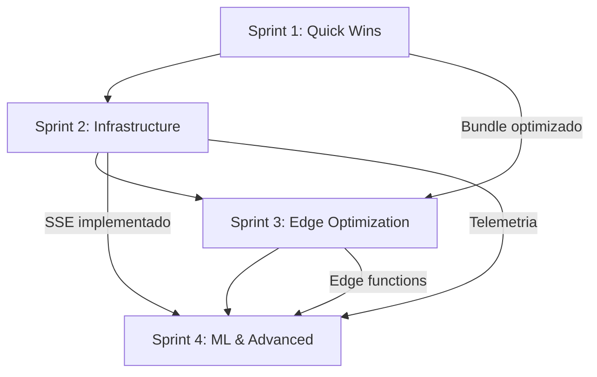

# SPRINT PLANNING OVERVIEW - CIDADÃO.AI FRONTEND

**Autor:** Anderson Henrique da Silva
**Data:** 04 de outubro de 2025
**Localização:** Minas Gerais, Brasil
**Versão:** 1.0
**Status:** Planejamento Executivo

---

## SUMÁRIO EXECUTIVO

Este documento apresenta o planejamento completo de 4 sprints para otimização e evolução da arquitetura frontend do projeto Cidadão.AI. O roadmap foi desenhado baseado em análise técnica profunda que identificou 5 problemas críticos e múltiplas oportunidades de diferenciação.

### Contexto
A partir da análise técnica detalhada (ver `docs/reports/ANALISE_TECNICA_ARQUITETURA_FRONTEND.md`), identificamos que apesar da arquitetura sólida, existem pontos de over-engineering, riscos de performance e gaps de qualidade que precisam ser endereçados antes de escalar o produto.

### Objetivos Estratégicos
1. **Performance**: Reduzir bundle size em 50% e memory footprint em 96%
2. **Qualidade**: Aumentar test coverage de 40% para 80%+
3. **Escalabilidade**: Implementar edge computing e distributed caching
4. **Diferenciação**: ML-driven adapter selection (único no mercado)
5. **Produção**: Sistema production-ready para crescimento global

---

## VISÃO GERAL DOS SPRINTS

### Cronograma Total
**Duração:** 5 semanas
**Equipe:** 2 engenheiros PhD (full-time)
**Metodologia:** Scrum adaptado para ambiente acadêmico

```
Sprint 1 (Semana 1)  → Quick Wins
Sprint 2 (Semana 2)  → Infrastructure
Sprint 3 (Semana 3)  → Edge Optimization
Sprint 4 (Semanas 4-5) → ML & Advanced Features
```

### Distribuição de Esforço

| Sprint | Foco Principal | Complexidade | Valor de Negócio | Risco |
|--------|----------------|--------------|------------------|-------|
| Sprint 1 | Performance | Baixa | Alto | Baixo |
| Sprint 2 | Qualidade | Média | Muito Alto | Médio |
| Sprint 3 | Infraestrutura | Média | Alto | Médio |
| Sprint 4 | Diferenciação | Alta | Muito Alto | Alto |

---

## SPRINT 1: QUICK WINS
**Duração:** 1 semana (5 dias úteis)
**Objetivo:** Otimizações de baixo esforço e alto impacto

### Entregas Principais
- ✅ Consolidar chat adapters: 6 → 3
- ✅ Remover ApexCharts (600KB economizados)
- ✅ Dynamic imports para componentes pesados
- ✅ Bundle analysis e documentação

### KPIs
- Bundle size: 400KB → 200KB (-50%)
- Adapters: 6 → 3 (-50%)
- Chart library: 800KB → 200KB (-75%)
- Build time: Redução estimada de 20%

### Risco: Baixo
- Tasks conhecidas
- Sem dependências externas
- Reversível se necessário

**📄 Documentação Detalhada:** [SPRINT_01_QUICK_WINS.md](./sprints/SPRINT_01_QUICK_WINS.md)

---

## SPRINT 2: INFRASTRUCTURE
**Duração:** 1 semana (5 dias úteis)
**Objetivo:** Resolver problemas críticos de arquitetura

### Entregas Principais
- ✅ Substituir WebSocket por SSE
- ✅ Migrar cache para IndexedDB
- ✅ Expandir test coverage: 40% → 70%
- ✅ CI/CD com coverage gates

### KPIs
- SSE streaming: Funcional no HuggingFace Spaces
- Cache RAM: 50MB → 2MB (-96%)
- Test coverage: 40% → 70% (+30pp)
- Critical paths: 100% coverage

### Risco: Médio
- Mudança de protocolo (WS → SSE)
- IndexedDB browser compatibility
- Test coverage ambicioso

**📄 Documentação Detalhada:** [SPRINT_02_INFRASTRUCTURE.md](./sprints/SPRINT_02_INFRASTRUCTURE.md)

---

## SPRINT 3: EDGE OPTIMIZATION
**Duração:** 1 semana (5 dias úteis)
**Objetivo:** Escalabilidade global com edge computing

### Entregas Principais
- ✅ Vercel Edge Functions
- ✅ Distributed cache (Vercel KV)
- ✅ Geographic routing
- ✅ Performance audit completo

### KPIs
- Edge latency: <10ms pre-processing
- Cache global: Hit rate >60%
- Lighthouse Score: >90
- Geographic coverage: 3+ regiões

### Risco: Médio
- Dependência de Vercel
- KV costs (monitorar)
- Performance testing complexo

**📄 Documentação Detalhada:** [SPRINT_03_EDGE_OPTIMIZATION.md](./sprints/SPRINT_03_EDGE_OPTIMIZATION.md)

---

## SPRINT 4: ML & ADVANCED FEATURES
**Duração:** 2 semanas (10 dias úteis)
**Objetivo:** Diferenciação competitiva com ML

### Entregas Principais
- ✅ ML adapter selection
- ✅ Advanced analytics dashboard
- ✅ A/B testing infrastructure
- ✅ Documentação acadêmica

### KPIs
- ML accuracy: >85% adapter prediction
- Cost reduction: ~20% (menos fallbacks)
- A/B experiments: 3+ simultâneos
- Paper draft: Completo

### Risco: Alto
- ML complexity
- Training data quality
- Model deployment

**📄 Documentação Detalhada:** [SPRINT_04_ML_ADVANCED.md](./sprints/SPRINT_04_ML_ADVANCED.md)

---

## DEPENDÊNCIAS ENTRE SPRINTS



### Dependências Críticas
1. **S1 → S2**: Bundle otimizado facilita testes
2. **S2 → S3**: SSE necessário para edge streaming
3. **S2 → S4**: Telemetria alimenta ML training
4. **S3 → S4**: Edge infrastructure para ML inference

### Bloqueadores Potenciais
- ⚠️ HuggingFace Spaces SSE support (Sprint 2)
- ⚠️ Vercel KV quota limits (Sprint 3)
- ⚠️ Training data quality (Sprint 4)

---

## RECURSOS NECESSÁRIOS

### Ferramentas & Infraestrutura

#### Sprint 1
```bash
# Development
- Node.js 18+
- npm/pnpm
- Webpack Bundle Analyzer
- Lighthouse CLI

# No custo adicional
```

#### Sprint 2
```bash
# Development
- Vitest + Playwright
- IndexedDB browser testing
- SSE client libraries

# Custo: $0 (open source)
```

#### Sprint 3
```bash
# Infrastructure
- Vercel Pro account ($20/mês)
- Vercel KV (Redis) ($10/mês estimado)
- Performance testing tools

# Custo: ~$30/mês
```

#### Sprint 4
```bash
# ML Infrastructure
- TensorFlow.js
- Training compute (local ou Google Colab)
- Analytics tools

# Custo: $0-50/mês (dependendo de compute)
```

### Equipe

**Configuração Ideal:**
- 2 Engenheiros PhD (full-time)
- 1 Code reviewer (part-time, opcional)
- 1 UX tester (part-time, Sprint 2 e 4)

**Distribuição de Responsabilidades:**

| Membro | Sprint 1 | Sprint 2 | Sprint 3 | Sprint 4 |
|--------|----------|----------|----------|----------|
| Eng #1 | Bundle + Adapters | SSE + Tests | Edge Functions | ML Model |
| Eng #2 | Charts Migration | IndexedDB + Tests | Vercel KV | Analytics |

---

## MÉTRICAS DE SUCESSO

### Sprint 1 - Quick Wins
```typescript
interface Sprint1Metrics {
  bundleSize: {
    before: '400KB',
    after: '200KB',
    reduction: '50%'
  },
  adapters: {
    before: 6,
    after: 3,
    reduction: '50%'
  },
  chartLibrary: {
    before: '800KB',
    after: '200KB',
    reduction: '75%'
  },
  buildTime: {
    reduction: '~20%'
  }
}
```

### Sprint 2 - Infrastructure
```typescript
interface Sprint2Metrics {
  streaming: {
    protocol: 'SSE',
    latency: '<100ms',
    support: 'HuggingFace Spaces'
  },
  cache: {
    memoryBefore: '50MB',
    memoryAfter: '2MB',
    reduction: '96%',
    persistent: true
  },
  testCoverage: {
    before: '40%',
    after: '70%',
    increase: '+30pp',
    criticalPaths: '100%'
  }
}
```

### Sprint 3 - Edge Optimization
```typescript
interface Sprint3Metrics {
  edge: {
    latency: '<10ms',
    regions: ['us-east', 'eu-west', 'ap-south'],
    preprocessing: true
  },
  cache: {
    type: 'Distributed (Vercel KV)',
    hitRate: '>60%',
    ttl: '3600s'
  },
  performance: {
    lighthouse: '>90',
    coreWebVitals: 'All Green',
    loadTime: '<2s'
  }
}
```

### Sprint 4 - ML & Advanced
```typescript
interface Sprint4Metrics {
  ml: {
    accuracy: '>85%',
    trainingData: '1000+ samples',
    inferenceLatency: '<5ms'
  },
  costOptimization: {
    reduction: '~20%',
    fallbacksAvoided: '>30%'
  },
  analytics: {
    dashboards: 3,
    metrics: '50+',
    realtime: true
  },
  abTesting: {
    activeExperiments: 3,
    framework: 'Custom + Analytics'
  }
}
```

---

## RISCOS & MITIGAÇÃO

### Sprint 1 - Risco Baixo

| Risco | Probabilidade | Impacto | Mitigação |
|-------|---------------|---------|-----------|
| Quebra de componentes ao remover ApexCharts | 20% | Médio | Testes visuais antes/depois, Feature flag |
| Performance regression | 10% | Baixo | Lighthouse CI, Performance budget |

### Sprint 2 - Risco Médio

| Risco | Probabilidade | Impacto | Mitigação |
|-------|---------------|---------|-----------|
| SSE não funciona no HF Spaces | 30% | Alto | Testar em ambiente staging primeiro |
| IndexedDB quota exceeded | 25% | Médio | Cleanup automático, warning ao usuário |
| Test coverage não atingida | 40% | Alto | Priorizar critical paths, timeboxing |

### Sprint 3 - Risco Médio

| Risco | Probabilidade | Impacto | Mitigação |
|-------|---------------|---------|-----------|
| Vercel KV costs excedem budget | 35% | Médio | Monitoring de custos, alertas |
| Edge functions cold start | 25% | Baixo | Warm-up strategy, caching |
| Geographic routing complexo | 30% | Médio | Start com 2 regiões, expandir gradualmente |

### Sprint 4 - Risco Alto

| Risco | Probabilidade | Impacto | Mitigação |
|-------|---------------|---------|-----------|
| ML model accuracy baixa (<70%) | 45% | Alto | Mais training data, feature engineering |
| TensorFlow.js bundle size | 35% | Médio | Dynamic loading, WASM backend |
| Training time excessivo | 30% | Baixo | Google Colab, dataset size limitado |

---

## CRITÉRIOS DE ACEITAÇÃO

### Definition of Done (DoD)

Cada sprint item é considerado **DONE** quando:

1. ✅ **Code Complete**
   - Código escrito, revisado, merged
   - Sem linter errors
   - TypeScript strict mode compliant

2. ✅ **Tested**
   - Unit tests escritos e passando
   - Integration tests (quando aplicável)
   - Manual testing checklist completo

3. ✅ **Documented**
   - README atualizado
   - JSDoc comments em funções públicas
   - CHANGELOG.md atualizado

4. ✅ **Performance Validated**
   - Bundle size dentro do budget
   - Lighthouse score > threshold
   - Core Web Vitals green

5. ✅ **Deployed**
   - Merged to main
   - Deploy em staging successful
   - Smoke tests em produção passando

### Sprint-Specific DoD

#### Sprint 1
- ✅ Bundle analysis report gerado
- ✅ Todos charts funcionando com Recharts
- ✅ 3 adapters com fallback testado

#### Sprint 2
- ✅ SSE streaming testado no HF Spaces
- ✅ IndexedDB funcionando em 5 browsers
- ✅ Test coverage report >70%

#### Sprint 3
- ✅ Edge functions deployed em produção
- ✅ Vercel KV monitoring configurado
- ✅ Lighthouse CI pipeline ativo

#### Sprint 4
- ✅ ML model deployed e servindo
- ✅ A/B testing framework documentado
- ✅ Paper draft completo

---

## CERIMÔNIAS SCRUM

### Daily Standup
**Quando:** Diariamente às 9h (15min)
**Formato:**
- O que fiz ontem?
- O que vou fazer hoje?
- Há bloqueadores?

**Ferramentas:** Discord/Slack + task board

### Sprint Planning
**Quando:** Primeiro dia de cada sprint (2h)
**Agenda:**
1. Review do sprint anterior (30min)
2. Apresentação dos objetivos do novo sprint (30min)
3. Breakdown de tasks (45min)
4. Commit de capacidade (15min)

### Sprint Review
**Quando:** Último dia de cada sprint (1h)
**Stakeholders:** Orientador PhD, colegas
**Formato:**
- Demo ao vivo (30min)
- Q&A (20min)
- Feedback collection (10min)

### Sprint Retrospective
**Quando:** Após Sprint Review (45min)
**Formato:**
- What went well? (15min)
- What could improve? (15min)
- Action items (15min)

---

## FERRAMENTAS & WORKFLOW

### Task Management
```
GitHub Projects (Kanban)
├── Backlog
├── To Do
├── In Progress
├── Code Review
├── Testing
└── Done
```

### CI/CD Pipeline
```yaml
# .github/workflows/ci.yml
name: CI/CD Pipeline

on: [push, pull_request]

jobs:
  test:
    - npm run lint
    - npm run type-check
    - npm run test:coverage
    - Coverage must be >70%

  build:
    - npm run build
    - Bundle size check
    - Lighthouse CI

  deploy:
    - Deploy to staging (auto)
    - Deploy to prod (manual approval)
```

### Code Review Checklist
- [ ] TypeScript strict compliance
- [ ] Tests added/updated
- [ ] Documentation updated
- [ ] Bundle size impact acceptable
- [ ] Accessibility tested
- [ ] Performance validated

### Git Branching Strategy
```
main
├── develop
    ├── sprint-1/adapter-consolidation
    ├── sprint-1/charts-migration
    ├── sprint-2/sse-implementation
    └── ...
```

**Rules:**
- Main: production-ready code only
- Develop: integration branch
- Feature branches: sprint-X/feature-name
- PR required para merge

---

## COMUNICAÇÃO

### Canais
- **Discord Server:** Daily standups, quick questions
- **GitHub Issues:** Bug reports, feature requests
- **GitHub Discussions:** Architecture decisions
- **Email:** Weekly progress report to stakeholders

### Reporting

#### Daily
- Standup notes no Discord
- Task board updates

#### Weekly
- Progress report email
- Metrics dashboard update

#### Sprint End
- Sprint review presentation
- Retrospective summary
- Updated roadmap

---

## DOCUMENTAÇÃO ADICIONAL

### Por Sprint
- [Sprint 1 - Quick Wins](./sprints/SPRINT_01_QUICK_WINS.md)
- [Sprint 2 - Infrastructure](./sprints/SPRINT_02_INFRASTRUCTURE.md)
- [Sprint 3 - Edge Optimization](./sprints/SPRINT_03_EDGE_OPTIMIZATION.md)
- [Sprint 4 - ML & Advanced Features](./sprints/SPRINT_04_ML_ADVANCED.md)

### Referências Técnicas
- [Análise Técnica Completa](../reports/ANALISE_TECNICA_ARQUITETURA_FRONTEND.md)
- [Architecture Decision Records](../technical/adr/)
- [Performance Benchmarks](../technical/performance/)
- [Test Coverage Reports](../technical/testing/)

---

## CHANGELOG

### Versão 1.0 - 04/10/2025
- ✅ Planejamento inicial completo
- ✅ 4 sprints definidos
- ✅ Métricas estabelecidas
- ✅ Riscos identificados

### Próximas Versões
- v1.1: Ajustes após Sprint 1 Review
- v1.2: Ajustes após Sprint 2 Review
- v1.3: Ajustes após Sprint 3 Review
- v2.0: Roadmap Q1 2026

---

## CONTATO

**Product Owner / Lead Engineer:**
Anderson Henrique da Silva
anderson.ufrj@gmail.com

**Repository:**
https://github.com/anderson-ufrj/cidadao.ai-frontend

**Documentation:**
https://github.com/anderson-ufrj/cidadao.ai-frontend/tree/main/docs

---

**STATUS:** 📋 Planning Complete - Ready for Sprint 1
**PRÓXIMO PASSO:** Kickoff Sprint 1 (Quick Wins)
**DATA PREVISTA:** Semana de 07/10/2025

---

*Este documento é versionado e será atualizado ao final de cada sprint para refletir aprendizados e ajustes de planejamento.*
